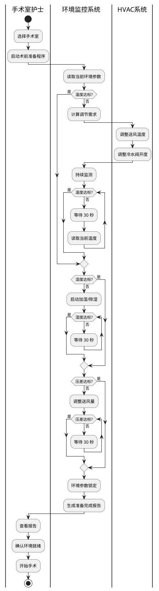

# 示例: 手术室环境控制 CIM 建模

**文档 ID**: `CIMU-CASE-OR-ENV-CONTROL`
**版本**: v1.0
**基于**: Singh & Sood 四层需求模型
**场景**: 综合手术室 (Hybrid Operating Room) 环境监控

---

## 场景描述

### 背景
某三甲医院新建一栋手术楼，其中包含 10 间综合手术室。每间手术室需要协调以下系统：
- HVAC 系统：温度、湿度、压差控制
- 照明系统：手术灯、环境照明
- 医疗设备：麻醉机、监护仪、C型臂
- 安全系统：门禁、消防、应急电源

### 挑战
1. 不同手术类型对环境要求不同
2. 多系统协调需要统一监控界面
3. 严格的合规要求 (JCI 标准)
4. 24/7 不间断运行

---

## 第一层: 用户需求 (User Requirements)

### 用例图 (Use Case Diagram)

```plantuml
@startuml
left to right direction
skinparam packageStyle rectangle

actor "手术医生" as Surgeon
actor "麻醉医生" as Anesthetist
actor "手术室护士" as Nurse
actor "运维工程师" as Engineer
actor "系统管理员" as Admin

rectangle "手术室环境监控系统" {
  
  package "环境监控" {
    usecase "查看实时环境数据" as UC_View
    usecase "接收告警通知" as UC_Alert
    usecase "导出历史数据" as UC_Export
  }
  
  package "环境控制" {
    usecase "自动环境维持" as UC_Auto
    usecase "手动参数调整" as UC_Manual
    usecase "术前环境准备" as UC_Prepare
    usecase "能耗优化模式" as UC_Energy
  }
  
  package "系统管理" {
    usecase "配置告警阈值" as UC_ConfigAlert
    usecase "系统维护" as UC_Maintain
    usecase "用户权限管理" as UC_Permission
  }
  
  ; 包含关系
  UC_Prepare ..> UC_Auto : <<include>>
  UC_Manual ..> UC_View : <<include>>
}

; 参与者关联
Surgeon --> UC_View
Surgeon --> UC_Auto

Anesthetist --> UC_View
Anesthetist --> UC_Alert

Nurse --> UC_View
Nurse --> UC_Alert
Nurse --> UC_Manual
Nurse --> UC_Prepare
Nurse --> UC_Export

Engineer --> UC_ConfigAlert
Engineer --> UC_Maintain
Engineer --> UC_Energy

Admin --> UC_Permission
Admin --> UC_ConfigAlert

@enduml
```

### 用例详述

#### UC1: 自动环境维持
**参与者**: 手术医生 (主要), 系统 (次要)
**触发条件**: 手术开始
**前置条件**: 术前环境准备已完成

**主流程**:
1. 护士在系统上标记"手术开始"
2. 系统自动锁定环境参数
3. 系统持续监控温度、湿度、压差
4. 如有偏差，自动调节 HVAC 系统
5. 所有调节记录到日志

**替代流程**:
- 4a. 自动调节失败 → 触发告警 → 护士手动介入

**后置条件**: 手术期间环境参数维持在设定范围内

---

## 第二层: 功能需求 (Functional Requirements)

### 活动图: 术前环境准备流程



### 功能规格说明

| 功能编号 | 功能名称 | 输入 | 处理 | 输出 |
|---------|---------|------|------|------|
| F-001 | 实时数据查看 | 传感器数据请求 | 读取最新数据 | 温度、湿度、压差显示 |
| F-002 | 自动环境维持 | 设定值 + 实时数据 | PID 控制算法 | 控制命令 (阀门、风机) |
| F-003 | 告警检测 | 实时数据 + 阈值 | 规则引擎判断 | 告警通知 |
| F-004 | 历史数据导出 | 时间范围 + 参数类型 | 数据库查询 | CSV/PDF 报告 |
| F-005 | 术前准备 | 手术室 ID | 自动化流程 | 准备完成报告 |

---

## 第三层: 非功能需求 (Non-Functional Requirements)

### 性能需求

```yaml
性能需求矩阵:
  
  响应时间:
    - 指标: 控制响应延迟
      目标: < 5 秒
      测试方法: 从设定值变化到执行器动作
    
    - 指标: 数据刷新频率
      目标: 每 5 秒
      测试方法: 监控数据时间戳
    
    - 指标: 告警延迟
      目标: < 10 秒
      测试方法: 模拟越限到通知发送
  
  吞吐量:
    - 指标: 并发手术室监控
      目标: 支持 50 间
      测试方法: 负载测试
    
    - 指标: 历史数据查询
      目标: 1 年数据 < 30 秒
      测试方法: 性能测试
  
  资源使用:
    - 指标: CPU 使用率
      目标: 平均 < 50%, 峰值 < 80%
    
    - 指标: 内存使用
      目标: < 4GB
```

### 可靠性需求

```yaml
可靠性需求:
  
  可用性:
    - 指标: 系统可用率
      目标: 99.99% (每年停机 < 52 分钟)
      计算: MTBF / (MTBF + MTTR)
    
    - 指标: 计划停机
      目标: 仅允许在凌晨 2-4 点
  
  容错:
    - 传感器冗余: 双传感器配置
    - 控制器冗余: 主备自动切换
    - 网络冗余: 双网卡绑定
  
  数据持久化:
    - 实时数据: 本地缓存 + 远程存储
    - 配置数据: 三副本存储
    - 备份策略: 每日增量, 每周全量
```

### 安全性需求

```yaml
安全性需求:
  
  访问控制:
    - 认证: 双因素认证 (密码 + 硬件令牌)
    - 授权: 基于角色的访问控制 (RBAC)
    - 审计: 所有操作记录日志
  
  数据安全:
    - 传输加密: TLS 1.3
    - 存储加密: AES-256
    - 密钥管理: HSM 硬件模块
  
  合规:
    - 医疗标准: JCI, 三甲评审
    - 安全标准: 等保 2.0 三级
    - 数据保护: 个人信息保护法
```

---

## 第四层: 组织需求 (Organizational Requirements)

### 组织结构

```
医院技术部门
├── 设施管理部 (Facilities)
│   ├── 暖通工程师 (HVAC Engineer)
│   ├── 电气工程师 (Electrical Engineer)
│   └── 维修技师 (Technician)
│
├── 手术室管理部 (OR Management)
│   ├── 手术室护士长 (Head Nurse)
│   ├── 巡回护士 (Circulating Nurse)
│   └── 器械护士 (Scrub Nurse)
│
└── 信息技术部 (IT)
    ├── 系统管理员 (System Admin)
    ├── 网络工程师 (Network Engineer)
    └── 数据库管理员 (DBA)
```

### 角色权限矩阵

| 角色 | 查看数据 | 调整参数 | 配置系统 | 维护设备 | 管理用户 |
|-----|---------|---------|---------|---------|---------|
| 系统管理员 | ✓ | ✓ | ✓ | ✓ | ✓ |
| 暖通工程师 | ✓ | ✓ | ✓ | ✓ | ✗ |
| 手术室护士长 | ✓ | ✓ | ✗ | ✗ | ✗ |
| 巡回护士 | ✓ | 临时调整 | ✗ | ✗ | ✗ |
| 手术医生 | ✓ | ✗ | ✗ | ✗ | ✗ |

### 工作流程

#### 变更管理流程
1. 提出变更申请 (工程师)
2. 影响评估 (系统管理员 + 护士长)
3. 审批 (设施部主任)
4. 实施 (指定维护窗口)
5. 验证 (工程师 + 护士)
6. 关闭变更单

#### 事件响应流程
1. 事件检测 (系统自动或人工报告)
2. 分级 (P1-紧急, P2-重要, P3-一般)
3. 响应 (P1: 15分钟, P2: 1小时, P3: 4小时)
4. 解决与记录
5. 事后分析 (P1/P2 必须)

---

## CIM 到 PIM 的映射

### 映射矩阵

| CIM 元素 | PIM 对应 | 说明 |
|---------|---------|------|
| 用例: 自动环境维持 | `ControlLoop` 服务接口 | 定义控制回路抽象 |
| 用例: 接收告警通知 | `AlertService` 接口 | 告警服务契约 |
| 活动: 温度调节 | `TemperatureControlAlgorithm` | PID 控制逻辑 |
| 活动: 湿度调节 | `HumidityControlAlgorithm` | 加湿/除湿逻辑 |
| 规则: 温度 21-24°C | ECLIF 完整性约束 | 形式化约束表达 |
| 规则: 湿度 45-60% | ECLIF 完整性约束 | 形式化约束表达 |
| 角色: 系统管理员 | `Role` + 权限矩阵 | RBAC 模型 |
| 性能: 响应时间 < 5s | SLA 指标定义 | 服务质量契约 |

### PIM 设计草图

```yaml
# 从 CIM 派生的 PIM 定义

Service: EnvironmentalControlService
  Interface:
    - startPreparation(roomId: String): PreparationResult
    - getCurrentStatus(roomId: String): RoomStatus
    - adjustSetpoint(roomId: String, parameter: String, value: Float): AdjustmentResult
    - acknowledgeAlert(alertId: String): void
  
  Preconditions:
    - user has permission for roomId
    - room exists and is active
  
  Postconditions:
    - state change logged
    - notifications sent if needed

Entity: ControlLoop
  Attributes:
    - loopId: String
    - controlType: Enum [TEMPERATURE, HUMIDITY, PRESSURE]
    - setpoint: Float
    - deadband: Float
    - algorithm: Enum [PID, ON_OFF, CASCADE]
  
  Methods:
    - calculateOutput(processValue: Float): ControlOutput
    - tuneParameters(params: TuningParameters): void

Constraint (ECLIF):
  ```
  (integrityConstraint
    (=> (and (OperatingRoom ?room)
             (surgeryStatus ?room IN_PROGRESS))
        (and (exists (?temp)
               (and (TemperatureSensor ?temp)
                    (locatedIn ?temp ?room)
                    (hasValue ?temp ?v)
                    (>= ?v 21.0)
                    (<= ?v 24.0)))
             (exists (?humidity)
               (and (HumiditySensor ?humidity)
                    (locatedIn ?humidity ?room)
                    (hasValue ?humidity ?h)
                    (>= ?h 45.0)
                    (<= ?h 60.0)))))
    HardIC
    "During surgery, temperature must be 21-24°C and humidity 45-60%")
  ```
```

---

## 验证检查表

### CIM 完整性检查

- [ ] 所有用户需求有用例覆盖
- [ ] 所有功能有活动图描述
- [ ] 非功能需求可测量
- [ ] 组织角色和权限清晰

### CIM-PIM 一致性检查

- [ ] 每个用例有对应的 PIM 接口
- [ ] 业务规则映射为约束
- [ ] 性能需求转化为 SLA
- [ ] 安全需求转化为授权模型

---

## 参考

- Singh, Y. & Sood, M. "The Impact of the Computational Independent Model for Enterprise Information System Development"
- JCI 医院评审标准 (第 6 版)
- 三甲医院评审标准 (2022 版)
- GB 50333 医院洁净手术部建筑技术规范
