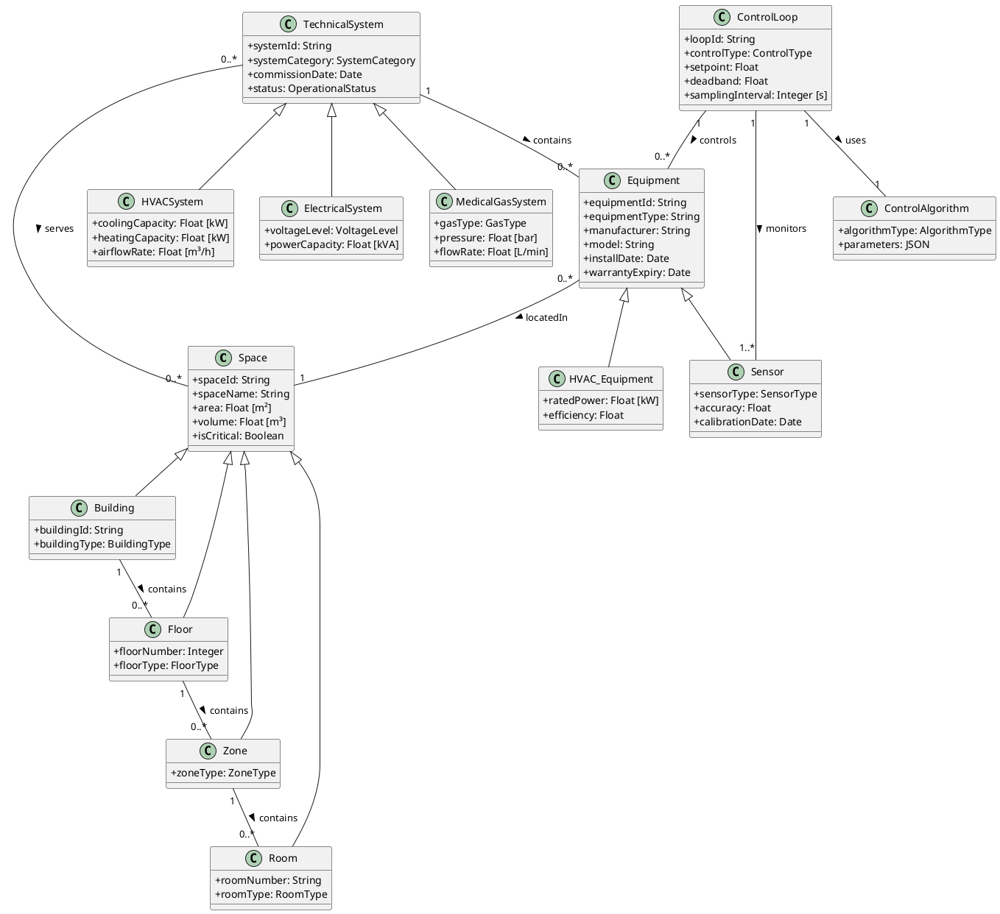

# 示例: 医疗建筑核心本体定义

**文档 ID**: `CIMU-CASE-HBCO-DEFINITION`
**版本**: v1.0
**基于**: Chungoora et al. 制造核心本体方法
**领域**: 医疗建筑技术系统

---

## 概述

医疗建筑核心本体 (Healthcare Building Core Ontology, HBCO) 是基于 Chungoora 等人提出的制造核心本体方法，针对医疗建筑领域的适配和扩展。HBCO 提供一组可扩展的正式定义的核心概念，支持：

1. **领域专业化**: 从核心概念派生特定领域本体
2. **知识验证**: 基于 ECLIF 的完整性约束验证
3. **跨系统互操作**: PIM 级别的语义共享

---

## 设计哲学

### 与制造核心本体的对比

| 维度 | 制造核心本体 (Chungoora) | 医疗建筑核心本体 (HBCO) |
|-----|------------------------|------------------------|
| **核心实体** | PartFamily, Feature, ManufacturingMethod | Space, TechnicalSystem, Equipment |
| **关注点** | 零件设计、加工特征、可制造性 | 空间环境、系统运行、合规性 |
| **约束类型** | 加工能力约束、工具可用性约束 | 环境参数约束、安全合规约束 |
| **互操作性** | CAD/CAM/PLM 系统 | BIM/BMS/IoT/医疗设备 |
| **验证目标** | 设计可制造性 | 环境合规性、患者安全 |

### 核心设计原则

```yaml
设计原则:
  
  1_过程导向:
    理念: 医疗建筑是持续运行的过程，而非静态实体
    体现: 强调状态、事件、控制回路
    
  2_多尺度整合:
    理念: 从设备级到建筑级的多层级建模
    体现: Space 层次结构 (Building → Floor → Zone → Room)
    
  3_约束驱动:
    理念: 医疗环境的严格约束是核心
    体现: ECLIF 完整性约束作为一等公民
    
  4_跨域桥接:
    理念: 连接建筑系统与医疗流程
    体现: ClinicalProcess 与 TechnicalSystem 的关联
```

---

## 核心概念体系

### 概念全景图

```
HBCO 核心概念
│
├── 空间维度 (Space)
│   ├── 空间层级: Building → Floor → Zone → Room
│   ├── 空间类型: ClinicalSpace, SupportSpace, CirculationSpace
│   └── 环境需求: TemperatureRange, HumidityRange, PressureDifferential
│
├── 系统维度 (TechnicalSystem)
│   ├── HVACSystem: 暖通空调
│   ├── ElectricalSystem: 电气系统
│   ├── PlumbingSystem: 给排水
│   ├── MedicalGasSystem: 医疗气体
│   └── FireProtectionSystem: 消防系统
│
├── 设备维度 (Equipment)
│   ├── HVAC_Equipment: AHU, Chiller, Pump, VAV
│   ├── Electrical_Equipment: Transformer, UPS, DistributionPanel
│   └── Medical_Equipment: 麻醉机, 监护仪 (临床设备关联)
│
├── 感知维度 (Sensing)
│   ├── Sensor: TemperatureSensor, HumiditySensor, PressureSensor
│   ├── Actuator: Valve, Damper, VFD
│   └── ControlLoop: 传感器-控制器-执行器闭环
│
└── 流程维度 (Process)
    ├── ClinicalProcess: 手术、ICU监护、急诊
    ├── OperationalState: 运行状态枚举
    └── Event: 告警、维护、状态转换
```

---

## UML 轻量级表示

### 核心类图



---

## ECLIF 重量级形式化

### 1. 基础类型声明

```eclif
; ============================================================
; HBCO: Healthcare Building Core Ontology
; ECLIF Formalization
; ============================================================

; ----- 核心类型 -----
(Type Space)
(Type Building)
(Type Floor)
(Type Zone)
(Type Room)

(Type TechnicalSystem)
(Type HVACSystem)
(Type ElectricalSystem)
(Type PlumbingSystem)
(Type MedicalGasSystem)
(Type FireProtectionSystem)

(Type Equipment)
(Type HVAC_Equipment)
(Type Electrical_Equipment)
(Type Plumbing_Equipment)
(Type MedicalGas_Equipment)

(Type Sensor)
(Type TemperatureSensor)
(Type HumiditySensor)
(Type PressureSensor)
(Type FlowSensor)
(Type CO2Sensor)

(Type Actuator)
(Type ControlLoop)
(Type ControlAlgorithm)

; ----- 值类型 -----
(Type Float)
(Type Integer)
(Type String)
(Type Boolean)
(Type DateTime)

; ----- 枚举类型 (作为子类型) -----
(Type OperationalStatus)
(Type RoomType)
(Type SystemCategory)
(Type SensorType)
```

### 2. 类型层次结构

```eclif
; ============================================================
; 类型层次 (Generalization)
; ============================================================

; ----- 空间层次 -----
(sup Building Space)
(sup Floor Space)
(sup Zone Space)
(sup Room Space)

; ----- 系统层次 -----
(sup HVACSystem TechnicalSystem)
(sup ElectricalSystem TechnicalSystem)
(sup PlumbingSystem TechnicalSystem)
(sup MedicalGasSystem TechnicalSystem)
(sup FireProtectionSystem TechnicalSystem)

; ----- 设备层次 -----
(sup HVAC_Equipment Equipment)
(sup Electrical_Equipment Equipment)
(sup Plumbing_Equipment Equipment)
(sup MedicalGas_Equipment Equipment)
(sup Sensor Equipment)

; ----- 传感器层次 -----
(sup TemperatureSensor Sensor)
(sup HumiditySensor Sensor)
(sup PressureSensor Sensor)
(sup FlowSensor Sensor)
(sup CO2Sensor Sensor)
```

### 3. 属性定义 (函数)

```eclif
; ============================================================
; 属性映射为函数
; ============================================================

; ----- Space 属性 -----
(BinaryFun spaceId)
(argProp spaceId 1 Space)
(argProp spaceId 2 String)

(BinaryFun spaceName)
(argProp spaceName 1 Space)
(argProp spaceName 2 String)

(BinaryFun area)
(argProp area 1 Space)
(argProp area 2 Float)

(BinaryFun volume)
(argProp volume 1 Space)
(argProp volume 2 Float)

(UnaryRel isCritical)
(argProp isCritical 1 Space)

; ----- TechnicalSystem 属性 -----
(BinaryFun systemId)
(argProp systemId 1 TechnicalSystem)
(argProp systemId 2 String)

(BinaryFun commissionDate)
(argProp commissionDate 1 TechnicalSystem)
(argProp commissionDate 2 DateTime)

(BinaryFun systemStatus)
(argProp systemStatus 1 TechnicalSystem)
(argProp systemStatus 2 OperationalStatus)

; ----- HVACSystem 属性 -----
(BinaryFun coolingCapacity)
(argProp coolingCapacity 1 HVACSystem)
(argProp coolingCapacity 2 Float)

(BinaryFun heatingCapacity)
(argProp heatingCapacity 1 HVACSystem)
(argProp heatingCapacity 2 Float)

; ----- Equipment 属性 -----
(BinaryFun equipmentId)
(argProp equipmentId 1 Equipment)
(argProp equipmentId 2 String)

(BinaryFun manufacturer)
(argProp manufacturer 1 Equipment)
(argProp manufacturer 2 String)

(BinaryFun installDate)
(argProp installDate 1 Equipment)
(argProp installDate 2 DateTime)

; ----- Sensor 属性 -----
(BinaryFun accuracy)
(argProp accuracy 1 Sensor)
(argProp accuracy 2 Float)

(BinaryFun calibrationDate)
(argProp calibrationDate 1 Sensor)
(argProp calibrationDate 2 DateTime)

; ----- ControlLoop 属性 -----
(BinaryFun setpoint)
(argProp setpoint 1 ControlLoop)
(argProp setpoint 2 Float)

(BinaryFun deadband)
(argProp deadband 1 ControlLoop)
(argProp deadband 2 Float)
```

### 4. 关系定义

```eclif
; ============================================================
; 关系定义
; ============================================================

; ----- 空间包含关系 -----
(BinaryRel contains)
(argProp contains 1 Space)
(argProp contains 2 Space)

; ----- 系统-空间服务关系 -----
(BinaryRel servesSpace)
(argProp servesSpace 1 TechnicalSystem)
(argProp servesSpace 2 Space)

; ----- 设备归属关系 -----
(BinaryRel componentOf)
(argProp componentOf 1 Equipment)
(argProp componentOf 2 TechnicalSystem)

; ----- 设备位置关系 -----
(BinaryRel locatedIn)
(argProp locatedIn 1 Equipment)
(argProp locatedIn 2 Space)

; ----- 控制回路关系 -----
(BinaryRel monitors)
(argProp monitors 1 ControlLoop)
(argProp monitors 2 Sensor)

(BinaryRel controls)
(argProp controls 1 ControlLoop)
(argProp controls 2 Actuator)

; ----- 三元关系: 传感器读数 -----
(TernaryRel hasReading)
(argProp hasReading 1 Sensor)
(argProp hasReading 2 DateTime)
(argProp hasReading 3 Float)
```

### 5. 完整性约束

```eclif
; ============================================================
; 完整性约束 (Integrity Constraints)
; ============================================================

; ----- 约束 1: 关键空间必须有空调系统 -----
(integrityConstraint
  (=> (and (Space ?s)
           (isCritical ?s))
      (exists (?hvac)
        (and (HVACSystem ?hvac)
             (servesSpace ?hvac ?s))))
  HardIC
  "Every critical space must be served by at least one HVAC system.")

; ----- 约束 2: 手术室必须有温度和湿度传感器 -----
(integrityConstraint
  (=> (supTC ?room OperatingRoom)
      (and (exists (?tempSensor)
             (and (TemperatureSensor ?tempSensor)
                  (locatedIn ?tempSensor ?room)))
           (exists (?humidSensor)
             (and (HumiditySensor ?humidSensor)
                  (locatedIn ?humidSensor ?room)))))
  HardIC
  "Every operating room must have both temperature and humidity sensors.")

; ----- 约束 3: 运行中的设备必须有所在位置 -----
(integrityConstraint
  (=> (and (Equipment ?e)
           (systemStatus ?e OPERATIONAL))
      (exists (?space)
        (and (Space ?space)
             (locatedIn ?e ?space))))
  HardIC
  "Every operational equipment must be located in a space.")

; ----- 约束 4: 传感器精度必须为正 -----
(integrityConstraint
  (=> (and (Sensor ?s)
           (accuracy ?s ?a))
      (> ?a 0.0))
  HardIC
  "Sensor accuracy must be positive.")

; ----- 约束 5: 传感器校准周期检查 (软性约束) -----
(integrityConstraint
  (=> (and (Sensor ?s)
           (calibrationDate ?s ?date)
           (currentDate ?now)
           (dateDiffMonths ?now ?date ?months)
           (> ?months 12))
      (needsRecalibration ?s))
  SoftIC
  "Sensors should be recalibrated annually.")

; ----- 约束 6: 设定值必须在合理范围内 -----
(integrityConstraint
  (=> (and (ControlLoop ?cl)
           (setpoint ?cl ?sp)
           (controlType ?cl TEMPERATURE))
      (and (>= ?sp 18.0) (<= ?sp 26.0)))
  HardIC
  "Temperature setpoint must be between 18°C and 26°C.")

; ----- 约束 7: 系统容量必须大于服务空间的总负荷 -----
(integrityConstraint
  (=> (and (HVACSystem ?hvac)
           (coolingCapacity ?hvac ?cap)
           (sumOfSpaceLoads ?hvac ?totalLoad))
      (>= ?cap ?totalLoad))
  HardIC
  "HVAC system capacity must be sufficient for served spaces.")
```

---

## 专业化机制

### 通过约束进行专业化

基于 Chungoora 的约束专业化方法，HBCO 支持从通用约束派生特定领域约束：

```eclif
; ============================================================
; 约束专业化示例: 温度控制
; ============================================================

; ----- 通用级别约束 (核心本体) -----
(integrityConstraint
  (=> (and (Room ?room)
           (hasTemperatureSetpoint ?room ?sp))
      (and (>= ?sp 18.0) (<= ?sp 26.0)))
  HardIC
  "Generic temperature range for all rooms.")

; ----- 产品生命周期级别专业化 (临床空间) -----
(integrityConstraint
  (=> (and (ClinicalSpace ?cs)
           (hasTemperatureSetpoint ?cs ?sp))
      (and (>= ?sp 20.0) (<= ?sp 25.0)))
  HardIC
  "Clinical spaces require tighter temperature control.")

; ----- 领域级别专业化 (手术室) -----
(integrityConstraint
  (=> (and (OperatingRoom ?or)
           (surgeryStatus ?or IN_PROGRESS)
           (hasTemperatureSetpoint ?or ?sp))
      (and (>= ?sp 21.0) (<= ?sp 24.0)))
  HardIC
  "Operating rooms during surgery: 21-24°C.")

; ----- 进一步专业化 (心脏手术室) -----
(integrityConstraint
  (=> (and (CardiacOperatingRoom ?cor)
           (surgeryStatus ?cor IN_PROGRESS)
           (hasTemperatureSetpoint ?cor ?sp))
      (and (>= ?sp 18.0) (<= ?sp 22.0)))
  HardIC
  "Cardiac surgery requires lower temperatures: 18-22°C.")
```

---

## 知识验证示例

### 跨域知识验证

基于 IMKS 方法，HBCO 支持在 PIM 级别定义跨域知识验证约束：

```eclif
; ============================================================
; 跨域知识验证: 设计可施工性检查
; ============================================================

; ----- 设计域知识 -----
; DesignFeature: LargeDuctRouting
; 设计了一个大风管路由

; ----- 施工域知识 -----
; ConstructionConstraint: DuctInstallationAccess
; 需要足够的安装空间

; ----- 知识验证约束 -----
(integrityConstraint
  (=> (and (DesignFeature ?df)
           (hasDuctSize ?df ?ductWidth)
           (locatedInShaft ?df ?shaft))
      (exists (?shaft)
        (and (BuildingShaft ?shaft)
             (hasAccessOpening ?shaft ?opening)
             (> ?opening (+ ?ductWidth 0.3)))))
  SoftIC
  "Duct installation requires shaft access opening at least 30cm larger than duct.")

; ============================================================
; 跨域知识验证: 设备维护可达性
; ============================================================

(integrityConstraint
  (=> (and (Equipment ?eq)
           (requiresMaintenance ?eq true)
           (locatedIn ?eq ?room))
      (exists (?clearance)
        (and (MaintenanceClearance ?clearance)
             (associatedWith ?clearance ?eq)
             (hasMinDimension ?clearance ?dim)
             (>= ?dim 1.0))))
  SoftIC
  "Maintainable equipment requires at least 1m clearance on service side.")
```

---

## 与标准对齐

### IFC 映射

| HBCO 概念 | IFC 实体 | 对齐说明 |
|----------|---------|---------|
| Space | IfcSpace | 直接对应 |
| Building | IfcBuilding | 直接对应 |
| Room | IfcSpace (With Room type) | 通过 PredefinedType |
| HVACSystem | IfcSystem / IfcDistributionSystem | 通过 SystemType |
| Equipment | IfcElement / IfcDistributionElement | 子类对应 |
| Sensor | IfcSensor | 直接对应 |

### Brick Schema 映射

| HBCO 概念 | Brick Class | 对齐说明 |
|----------|-------------|---------|
| TemperatureSensor | brick:Temperature_Sensor | 直接对应 |
| HVACSystem | brick:HVAC_System | 直接对应 |
| Room | brick:Room | 直接对应 |
| servesSpace | brick:feeds | 语义等价 |
| locatedIn | brick:isLocatedIn | 语义等价 |

---

## 使用示例

### 实例化: 手术室 OR-301

```eclif
; ============================================================
; 实例化示例: 手术室 OR-301
; ============================================================

; ----- 声明实例 -----
(OperatingRoom OR-301)
(contextFor OR-301 Hospital-A)

; ----- 属性赋值 -----
(spaceName OR-301 "Operating Room 301")
(area OR-301 45.0)
(volume OR-301 135.0)
(isCritical OR-301 true)
(roomNumber OR-301 "OR-301")

; ----- 关联传感器 -----
(TemperatureSensor TEMP-301-A)
(locatedIn TEMP-301-A OR-301)
(accuracy TEMP-301-A 0.1)

(TemperatureSensor TEMP-301-B)
(locatedIn TEMP-301-B OR-301)
(accuracy TEMP-301-B 0.1)

(HumiditySensor HUM-301)
(locatedIn HUM-301 OR-301)
(accuracy HUM-301 2.0)

(PressureSensor PRES-301)
(locatedIn PRES-301 OR-301)
(accuracy PRES-301 0.5)

; ----- 关联 HVAC 系统 -----
(HVACSystem HVAC-OR3)
(servesSpace HVAC-OR3 OR-301)
(coolingCapacity HVAC-OR3 25.0)
(heatingCapacity HVAC-OR3 15.0)

; ----- 控制回路 -----
(ControlLoop CL-TEMP-301)
(setpoint CL-TEMP-301 22.0)
(deadband CL-TEMP-301 0.5)
(monitors CL-TEMP-301 TEMP-301-A)
(monitors CL-TEMP-301 TEMP-301-B)
```

---

## 验证检查表

### 本体完整性

- [ ] 所有核心概念有 ECLIF 类型定义
- [ ] 类型层次无循环继承
- [ ] 所有关系有明确的签名定义
- [ ] 完整性约束覆盖关键业务规则

### 与制造核心本体的一致性

- [ ] 概念映射关系明确
- [ ] 约束专业化机制一致
- [ ] 知识验证方法兼容

### 领域适配性

- [ ] 医疗建筑特有概念已覆盖
- [ ] 合规要求有约束表达
- [ ] 与 IFC/Brick 标准可映射

---

## 参考

- Chungoora, N., et al. "面向制造系统互操作性和知识共享的模型驱动本体方法"
- ISO/IEC 24707:2007 - Common Logic framework
- ISO 16739 (IFC) - Industry Foundation Classes
- Brick Schema - Building metadata schema
