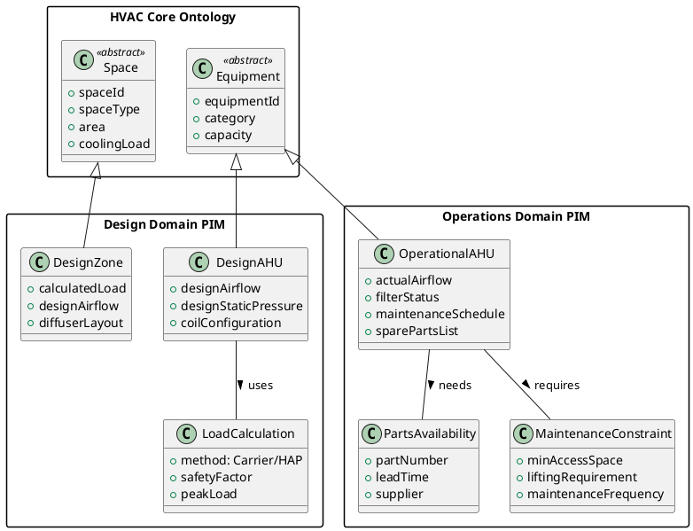
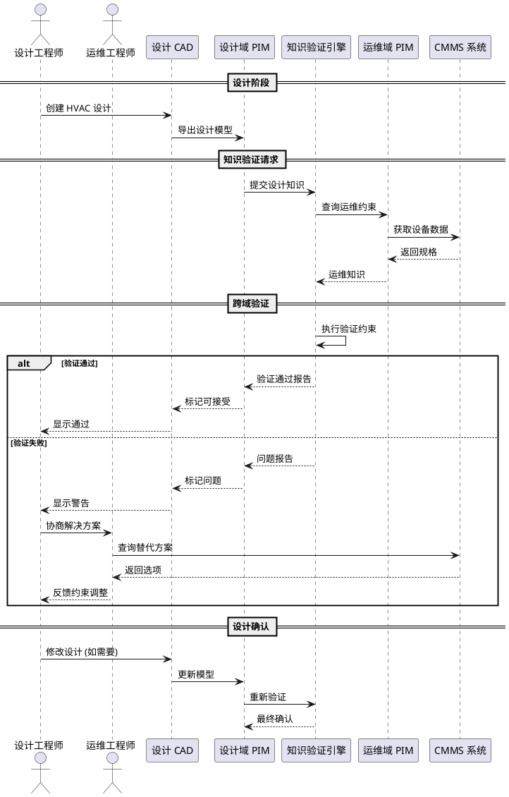

# 示例: HVAC 系统 PIM 级互操作性

**文档 ID**: `CIMU-CASE-HVAC-PIM-INTEROP`  
**版本**: v1.0  
**基于**: Chungoora et al. IMKS 模型驱动概念  
**场景**: 设计域与运维域的 HVAC 知识共享

---

## 场景描述

### 背景
某医院 HVAC 系统改造项目涉及两个团队：
- **设计团队**: 负责空调末端设计 (Design Domain)
- **运维团队**: 负责设备选型和维护 (Operations Domain)

### 互操作性挑战
1. 设计团队选择的末端设备可能不适合现有运维能力
2. 运维团队的设备约束需要反馈到设计过程
3. 两个团队使用不同的软件平台 (CAD vs CMMS)

### 解决方案
基于 IMKS 方法，在 PIM 级别建立共享的 HVAC 核心本体，实现：
- 设计知识的可验证性
- 跨域知识验证约束
- 知识共享机制

---

## PIM 架构

### 双域 PIM 结构

```
HVAC 核心本体 (HVAC Core Ontology)
│
├── 设计域 PIM (Design Domain PIM)
│   ├── 负荷计算模型
│   ├── 末端选型逻辑
│   └── 气流组织设计
│
└── 运维域 PIM (Operations Domain PIM)
    ├── 设备规格模型
    ├── 维护策略定义
    └── 运行约束规则

知识验证约束 (Cross-Domain Constraints)
├── 设计可维护性检查
├── 设备可得性验证
└── 性能匹配检查
```

### UML 表示



---

## ECLIF 形式化

### 1. HVAC 核心本体

```eclif
; ============================================================
; HVAC 核心本体 (平台无关)
; ============================================================

; ----- 核心类型 -----
(Type HVAC_Equipment)
(Type AirHandlingUnit)
(Type Chiller)
(Type CoolingTower)
(Type Pump)
(Type HeatExchanger)

(Type HVAC_Space)
(Type ConditionedZone)

; ----- 属性 -----
(BinaryFun nominalCapacity)
(argProp nominalCapacity 1 HVAC_Equipment)
(argProp nominalCapacity 2 Float)

(BinaryFun designAirflow)
(argProp designAirflow 1 AirHandlingUnit)
(argProp designAirflow 2 Float)

(BinaryFun calculatedLoad)
(argProp calculatedLoad 1 ConditionedZone)
(argProp calculatedLoad 2 Float)

; ----- 关系 -----
(BinaryRel servesZone)
(argProp servesZone 1 AirHandlingUnit)
(argProp servesZone 2 ConditionedZone)
```

### 2. 设计域 PIM

```eclif
; ============================================================
; 设计域 PIM (Design Domain)
; ============================================================

; ----- 设计专用类型 -----
(Type DesignAHU)
(Type DesignZone)
(Type LoadCalculation)

; ----- 设计域专业化 -----
(sup DesignAHU AirHandlingUnit)
(sup DesignZone ConditionedZone)

; ----- 设计属性 -----
(BinaryFun designStaticPressure)
(argProp designStaticPressure 1 DesignAHU)
(argProp designStaticPressure 2 Float)

(BinaryFun safetyFactor)
(argProp safetyFactor 1 LoadCalculation)
(argProp safetyFactor 2 Float)

; ----- 设计关系 -----
(BinaryRel hasLoadCalculation)
(argProp hasLoadCalculation 1 DesignZone)
(argProp hasLoadCalculation 2 LoadCalculation)

(TernaryRel selectsEquipment)
(argProp selectsEquipment 1 DesignZone)
(argProp selectsEquipment 2 LoadCalculation)
(argProp selectsEquipment 3 DesignAHU)
```

### 3. 运维域 PIM

```eclif
; ============================================================
; 运维域 PIM (Operations Domain)
; ============================================================

; ----- 运维专用类型 -----
(Type OperationalAHU)
(Type MaintenanceConstraint)
(Type PartsAvailability)

; ----- 运维域专业化 -----
(sup OperationalAHU AirHandlingUnit)

; ----- 运维属性 -----
(BinaryFun maintenanceFrequency)
(argProp maintenanceFrequency 1 OperationalAHU)
(argProp maintenanceFrequency 2 Integer)

(BinaryFun minAccessSpace)
(argProp minAccessSpace 1 MaintenanceConstraint)
(argProp minAccessSpace 2 Float)

(BinaryFun partLeadTime)
(argProp partLeadTime 1 PartsAvailability)
(argProp partLeadTime 2 Integer)

; ----- 运维关系 -----
(BinaryRel subjectTo)
(argProp subjectTo 1 OperationalAHU)
(argProp subjectTo 2 MaintenanceConstraint)

(BinaryRel requiresPart)
(argProp requiresPart 1 OperationalAHU)
(argProp requiresPart 2 PartsAvailability)
```

---

## 跨域知识验证约束

### 约束 1: 设计可维护性检查

```eclif
; ============================================================
; 知识验证约束 1: 设计可维护性
; 检查设计选型是否满足运维空间要求
; ============================================================

(integrityConstraint
  (=> (and (DesignAHU ?designAHU)
           (designStaticPressure ?designAHU ?dsp)
           (selectsEquipment ?zone ?calc ?designAHU)
           (exists (?opsAHU)
             (and (OperationalAHU ?opsAHU)
                  (mapsTo ?designAHU ?opsAHU)
                  (subjectTo ?opsAHU ?maintConst)
                  (minAccessSpace ?maintConst ?minSpace))))
      (exists (?actualSpace)
        (and (>= ?actualSpace ?minSpace)
             (hasMaintenanceSpace ?designAHU ?actualSpace))))
  SoftIC
  "Design AHU must provide sufficient maintenance access space.")
```

**解释**:
- 前提: 设计选型的 AHU 有某个静压设计值
- 检查: 对应的运维 AHU 有维护空间要求
- 结论: 设计必须提供至少满足最小要求的空间

### 约束 2: 设备可得性验证

```eclif
; ============================================================
; 知识验证约束 2: 设备可得性
; 检查选型设备的关键备件是否有合理交货期
; ============================================================

(integrityConstraint
  (=> (and (DesignAHU ?designAHU)
           (selectedForProject ?designAHU ?project)
           (exists (?opsAHU ?criticalPart)
             (and (OperationalAHU ?opsAHU)
                  (mapsTo ?designAHU ?opsAHU)
                  (requiresPart ?opsAHU ?criticalPart)
                  (isCriticalPart ?criticalPart true)
                  (partLeadTime ?criticalPart ?leadTime))))
      (<= ?leadTime 14))
  SoftIC
  "Critical spare parts lead time should not exceed 14 days.")
```

**解释**:
- 前提: 设计选型已确定用于项目
- 检查: 对应运维设备的关健备件交货期
- 结论: 交货期不应超过 14 天 (预警)

### 约束 3: 性能匹配检查

```eclif
; ============================================================
; 知识验证约束 3: 性能匹配
; 检查设计负荷与设备能力的匹配
; ============================================================

(integrityConstraint
  (=> (and (DesignZone ?zone)
           (hasLoadCalculation ?zone ?calc)
           (calculatedLoad ?zone ?load)
           (safetyFactor ?calc ?sf)
           (selectsEquipment ?zone ?calc ?ahu))
      (exists (?capacity)
        (and (nominalCapacity ?ahu ?capacity)
             (>= ?capacity (* ?load (+ 1.0 ?sf))))))
  HardIC
  "AHU capacity must cover zone load with safety factor.")
```

**解释**:
- 前提: 设计区域有负荷计算和安全系数
- 检查: 选型 AHU 的额定容量
- 结论: 容量必须 ≥ 负荷 × (1 + 安全系数)

### 约束 4: 过滤器维护可达性

```eclif
; ============================================================
; 知识验证约束 4: 过滤器维护
; 检查过滤器更换空间要求
; ============================================================

(integrityConstraint
  (=> (and (DesignAHU ?ahu)
           (hasFilterSection ?ahu true)
           (filterDimensions ?ahu ?length ?width ?height)
           (exists (?opsAHU)
             (and (OperationalAHU ?opsAHU)
                  (mapsTo ?ahu ?opsAHU)
                  (maintenanceFrequency ?opsAHU ?freq)
                  (> ?freq 4))))
      (exists (?clearance)
        (and (hasFilterClearance ?ahu ?clearance)
             (>= ?clearance (* 2.0 ?length)))))
  SoftIC
  "Frequent filter maintenance requires 2x filter length clearance.")
```

---

## 知识共享流程

### PIM 级互操作架构

```
┌─────────────────────────────────────────────────────────────┐
│                    PIM 级知识验证层                          │
│  ┌───────────────────────────────────────────────────────┐  │
│  │           跨域知识验证约束 (ECLIF)                      │  │
│  │  ┌─────────────┐    ┌─────────────┐                  │  │
│  │  │ 设计可维护性 │    │ 设备可得性   │                  │  │
│  │  └─────────────┘    └─────────────┘                  │  │
│  │  ┌─────────────┐    ┌─────────────┐                  │  │
│  │  │ 性能匹配    │    │ 维护可达性   │                  │  │
│  │  └─────────────┘    └─────────────┘                  │  │
│  └───────────────────────────────────────────────────────┘  │
└─────────────────────────────────────────────────────────────┘
                              │
              ┌───────────────┼───────────────┐
              ▼               ▼               ▼
┌─────────────────┐ ┌─────────────────┐ ┌─────────────────┐
│   设计域 PIM     │ │  HVAC 核心本体   │ │   运维域 PIM     │
│  (ECLIF)        │ │   (ECLIF)        │ │  (ECLIF)        │
├─────────────────┤ ├─────────────────┤ ├─────────────────┤
│ • DesignAHU     │ │ • Equipment     │ │ • OperationalAHU│
│ • DesignZone    │ │ • Space         │ │ • Maintenance   │
│ • LoadCalc      │ │ • Relationship  │ │ • Parts         │
└─────────────────┘ └─────────────────┘ └─────────────────┘
                              │
              ┌───────────────┼───────────────┐
              ▼               ▼               ▼
┌─────────────────┐ ┌─────────────────┐ ┌─────────────────┐
│   PSM 设计平台   │ │   知识验证引擎   │ │   PSM 运维平台   │
│  (CAD/Revit)    │ │   (IODE/推理)    │ │  (CMMS/IBM Max) │
└─────────────────┘ └─────────────────┘ └─────────────────┘
```

### 知识共享时序



---

## 实施示例

### 场景: 手术室 AHU 选型验证

#### 设计输入
```yaml
设计域 PIM 实例:
  DesignZone: OR-301
    calculatedLoad: 25.5 kW
    spaceType: OPERATING_ROOM
    
  LoadCalculation: LC-301
    method: "Carrier HAP"
    safetyFactor: 0.15
    
  DesignAHU: AHU-301-D
    designAirflow: 4500 m³/h
    designStaticPressure: 800 Pa
    coilConfiguration: "4-row cooling"
```

#### 运维约束
```yaml
运维域 PIM 实例:
  OperationalAHU: AHU-301-OPS
    mapsTo: AHU-301-D
    maintenanceFrequency: 6  # 次/年
    
  MaintenanceConstraint: MC-301
    minAccessSpace: 1.5  # m
    filterDimensions: [0.6, 0.6, 0.05]  # m
    
  PartsAvailability: PA-MOTOR-01
    partNumber: "BALDOR-EM3546"
    leadTime: 10  # 天
    isCritical: true
```

#### 知识验证执行

```eclif
; 验证执行过程

; 1. 性能匹配检查
(calculatedLoad OR-301 25.5)
(safetyFactor LC-301 0.15)
; 计算所需容量: 25.5 * 1.15 = 29.325 kW
(nominalCapacity AHU-301-D 35.0)
; 检查: 35.0 >= 29.325 ✓ PASS

; 2. 可维护性检查
(designStaticPressure AHU-301-D 800)
(minAccessSpace MC-301 1.5)
; 检查设计是否提供足够空间...
; 假设设计提供了 2.0m 空间
; 检查: 2.0 >= 1.5 ✓ PASS

; 3. 设备可得性检查
(partLeadTime PA-MOTOR-01 10)
(isCriticalPart PA-MOTOR-01 true)
; 检查: 10 <= 14 ✓ PASS
```

#### 验证结果报告

```yaml
知识验证报告:
  项目: 手术室 OR-301 AHU 选型
  验证时间: 2024-01-15 10:30:00
  
  约束检查结果:
    - 性能匹配检查: PASS
      所需容量: 29.325 kW
      设备容量: 35.0 kW
      余量: 19.4%
      
    - 设计可维护性: PASS
      要求空间: 1.5 m
      设计空间: 2.0 m
      
    - 设备可得性: PASS
      关键备件交货期: 10 天
      最大允许: 14 天
      
    - 过滤器维护可达性: WARNING
      过滤器长度: 0.6 m
      推荐空间: 1.2 m
      设计空间: 0.8 m
      建议: 增加过滤器段旁空间至 1.2m

  总体结论: CONDITIONAL_PASS
  建议措施:
    1. 确认过滤器维护空间可调整
    2. 如无法调整,需制定特殊维护程序
```

---

## 与现有系统集成

### 从设计 CAD 导出到 PIM

```python
# 示例: Revit 导出到 Design Domain PIM
class RevitToPIMExporter:
    """将 Revit 模型导出为 ECLIF PIM"""
    
    def export_ahu(self, revit_element):
        """导出 AHU 到设计域 PIM"""
        
        # 提取 Revit 参数
        design_data = {
            'equipmentId': revit_element.GetParameters('Mark'),
            'designAirflow': revit_element.GetParameters('Design_Airflow'),
            'designStaticPressure': revit_element.GetParameters('Design_Pressure'),
            'coilConfiguration': revit_element.GetParameters('Coil_Config')
        }
        
        # 生成 ECLIF
        eclif_code = f"""
        (DesignAHU {design_data['equipmentId']})
        (designAirflow {design_data['equipmentId']} {design_data['designAirflow']})
        (designStaticPressure {design_data['equipmentId']} {design_data['designStaticPressure']})
        """
        
        return eclif_code
```

### 从 CMMS 导出到 PIM

```python
# 示例: IBM Maximo 导出到 Operations Domain PIM
class MaximoToPIMExporter:
    """将 Maximo 数据导出为 ECLIF PIM"""
    
    def export_equipment(self, asset_id):
        """导出设备到运维域 PIM"""
        
        # 查询 Maximo
        asset_data = self.maximo_client.get_asset(asset_id)
        
        # 生成 ECLIF
        eclif_code = f"""
        (OperationalAHU {asset_data['assetnum']})
        (maintenanceFrequency {asset_data['assetnum']} {asset_data['maint_freq']})
        """
        
        # 关联维护约束
        for constraint in asset_data['maintenance_constraints']:
            eclif_code += f"""
        (MaintenanceConstraint MC-{asset_id})
        (subjectTo {asset_data['assetnum']} MC-{asset_id})
        (minAccessSpace MC-{asset_id} {constraint['min_space']})
        """
        
        return eclif_code
```

---

## 验证检查表

### PIM 定义完整性

- [ ] HVAC 核心本体覆盖通用概念
- [ ] 设计域 PIM 专业化正确
- [ ] 运维域 PIM 专业化正确
- [ ] 跨域映射关系定义清晰

### 知识验证约束有效性

- [ ] 约束逻辑可表达为 ECLIF
- [ ] 约束可实际执行验证
- [ ] 验证结果有意义且可操作
- [ ] 约束覆盖关键互操作场景

### 系统集成可行性

- [ ] CAD 到 PIM 导出可行
- [ ] CMMS 到 PIM 导出可行
- [ ] 知识验证引擎可接入
- [ ] 验证结果可反馈到设计流程

---

## 参考

- Chungoora, N., et al. "面向制造系统互操作性和知识共享的模型驱动本体方法"
- IMKS Project: Interoperable Manufacturing Knowledge Systems
- ECLIF Reference: Extended Common Logic Interchange Format
- ISO/IEC 24707: Common Logic Framework
