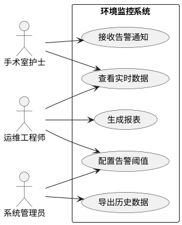
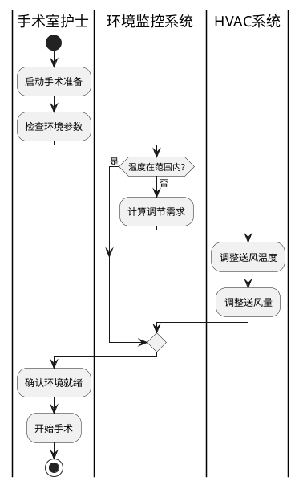
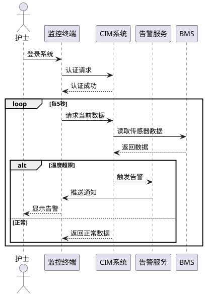

# PRP: CIM Context Engineering 扩展实施蓝图

**文档 ID**: `CIMU-PRP-CONTEXT-EXT-V1`
**版本**: v1.0
**基于**: INITIAL.md (CIM Context Engineering 扩展需求)
**来源文献**:
- Singh, Y. & Sood, M. "The Impact of the Computational Independent Model for Enterprise Information System Development"
- Chungoora et al. "面向制造系统互操作性和知识共享的模型驱动本体方法"

---

## 执行摘要

本 PRP 定义了基于两篇学术论文扩展 CIM 项目 Context Engineering 体系的完整实施计划。通过引入四层需求捕获模型和本体驱动的 PIM 形式化方法，建立从业务需求到技术实现的完整方法论。

**置信度评分**: 9/10
**预计工作量**: 3-4 天
**依赖**: 现有 Context Engineering 基础设施

---

## 阶段 1: CIM 需求捕获框架建立

### 1.1 创建需求分类体系文档

**任务**: 在 `00_foundations/` 创建 `13_cim_requirements_framework.md`

**内容规范**:
```markdown
# CIM 需求捕获框架

## 四层需求模型

### L1: 用户需求 (User Requirements)
- **定义**: 用户指定的系统交付物，不考虑实现平台
- **表达方式**: 用例图 (Use Case Diagram)
- **关键问题**: "系统应该为用户做什么？"
- **示例**: 
  - 手术室护士能够查看实时温湿度
  - 运维工程师能够接收设备告警

### L2: 功能需求 (Functional Requirements)
- **定义**: 期望的系统行为规格
- **表达方式**: 活动图 (Activity Diagram)
- **关键问题**: "系统如何实现业务功能？"
- **示例**:
  - 当温度超出范围时触发告警
  - 每小时记录一次能耗数据

### L3: 非功能需求 (Non-Functional Requirements)
- **定义**: 可测量的系统质量属性
- **表达方式**: 约束声明 + 指标定义
- **关键问题**: "系统的性能、可靠性要求？"
- **示例**:
  - 系统可用性: 99.9%
  - 响应时间: < 2秒
  - 数据保留: 3年

### L4: 组织需求 (Organizational Requirements)
- **定义**: 组织结构、流程、用户类别规格
- **表达方式**: 组织图 + 角色定义
- **关键问题**: "谁在使用系统？在什么组织架构下？"
- **示例**:
  - 三级权限体系: 管理员/工程师/观察员
  - 审批流程: 变更需经主管确认
```

**验证标准**:
- [ ] 四层模型定义完整
- [ ] 每层有明确的表达方式
- [ ] 提供医疗建筑领域示例
- [ ] 与现有 CIM 定义兼容

### 1.2 创建 UML 图表规范

**任务**: 在 `20_templates/` 创建 `uml_diagrams_template.md`

**模板内容**:
```markdown
# UML 图表规范模板

## 用例图 (Use Case Diagram)

### 目的
捕获用户与系统的交互，从用户视角描述功能需求。

### 元素规范
- **Actor**: 人形图标，标注角色名称
- **Use Case**: 椭圆，标注动词+名词
- **System Boundary**: 矩形框，标注系统名称
- **Relationships**: 
  - 关联: Actor → Use Case (实线)
  - 包含: Use Case A ──(include)──→ Use Case B (虚线箭头)
  - 扩展: Use Case A ──(extend)──→ Use Case B (虚线箭头)

### 医疗建筑示例


## 活动图 (Activity Diagram)

### 目的
描述业务流程或系统操作的步骤序列。

### 元素规范
- **开始/结束**: 实心圆/带圈实心圆
- **活动**: 圆角矩形
- **决策**: 菱形
- **并行**: 粗横线 (fork/join)
- **泳道**: 按角色/系统划分

### 医疗建筑示例: 手术室环境调控流程


## 序列图 (Sequence Diagram)

### 目的
展示对象间交互的时间顺序。

### 元素规范
- **参与者**: 顶部矩形，带虚线生命线
- **消息**: 水平箭头，标注消息名称
- **激活条**: 生命线上的窄矩形
- **循环/条件**: alt/opt/loop 框

### 医疗建筑示例: 告警处理时序

```

**验证标准**:
- [ ] 三种 UML 图表规范完整
- [ ] 提供 PlantUML 代码示例
- [ ] 与医疗建筑场景结合
- [ ] 可直接复用的模板

---

## 阶段 2: 本体驱动的 PIM 形式化

### 2.1 创建核心本体框架文档

**任务**: 在 `00_foundations/` 创建 `14_core_ontology_framework.md`

**核心内容**:
```markdown
# 医疗建筑核心本体框架

## 概述

基于 Chungoora 等人的制造核心本体方法，建立医疗建筑领域核心本体 (Healthcare Building Core Ontology, HBCO)。

## 设计原则

### 1. 可扩展性 (Extensibility)
- 核心概念可专业化为特定领域
- 支持多层级语义约束继承

### 2. 形式化 (Formality)
- 使用 ECLIF 表达语义约束
- 支持逻辑推理和知识验证

### 3. 互操作性 (Interoperability)
- 与 IFC、Brick Schema 对齐
- 支持跨平台知识共享

## 核心概念体系

### 空间维度 (Space Dimension)
```yaml
核心概念: Space
属性:
  - space_id: 唯一标识
  - space_type: 空间类型枚举
  - environmental_requirements: 环境需求集合

专业化为:
  - ClinicalSpace: 临床空间
    - OperatingRoom: 手术室
    - ICU: 重症监护室
    - Ward: 病房
  - SupportSpace: 支持空间
    - MechanicalRoom: 机房
    - Storage: 存储间
```

### 系统维度 (System Dimension)
```yaml
核心概念: TechnicalSystem
属性:
  - system_id: 唯一标识
  - system_category: 系统类别枚举
  - performance_parameters: 性能参数集合

专业化为:
  - HVACSystem: 暖通系统
  - ElectricalSystem: 电气系统
  - PlumbingSystem: 给排水系统
  - MedicalGasSystem: 医疗气体系统
```

### 设备维度 (Equipment Dimension)
```yaml
核心概念: Equipment
属性:
  - equipment_id: 唯一标识
  - equipment_type: 设备类型
  - operational_status: 运行状态

关系:
  - component_of: 属于某个系统
  - located_in: 位于某个空间
  - connected_to: 连接到其他设备
```

## ECLIF 形式化基础

### 类型定义
```eclif
; 核心类型声明
(Type Space)
(Type TechnicalSystem)
(Type Equipment)
(Type Sensor)
(Type ControlLoop)

; 空间类型层次
(sup OperatingRoom Space)
(sup ICU Space)
(sup Ward Space)

; 系统类型层次
(sup HVACSystem TechnicalSystem)
(sup ElectricalSystem TechnicalSystem)
```

### 关系定义
```eclif
; 二元关系: 系统服务空间
(BinaryRel servesSpace)
(argProp servesSpace 1 TechnicalSystem)
(argProp servesSpace 2 Space)

; 二元关系: 设备属于系统
(BinaryRel componentOf)
(argProp componentOf 1 Equipment)
(argProp componentOf 2 TechnicalSystem)

; 二元关系: 设备位于空间
(BinaryRel locatedIn)
(argProp locatedIn 1 Equipment)
(argProp locatedIn 2 Space)

; 三元关系: 传感器测量参数
(TernaryRel measures)
(argProp measures 1 Sensor)
(argProp measures 2 Parameter)
(argProp measures 3 NumericValue)
```

## 完整性约束示例

### 约束 1: 手术室必须有空调系统
```eclif
(integrityConstraint
  (=> (supTC ?space OperatingRoom)
      (exists (?hvac)
        (and (supTC ?hvac HVACSystem)
             (servesSpace ?hvac ?space))))
  HardIC
  "Every OperatingRoom must be served by at least one HVACSystem.")
```

### 约束 2: 运行中的设备必须有所在位置
```eclif
(integrityConstraint
  (=> (and (Equipment ?e)
           (operationalStatus ?e RUNNING))
      (exists (?space)
        (and (Space ?space)
             (locatedIn ?e ?space))))
  HardIC
  "Every running Equipment must be located in a Space.")
```

### 约束 3: 温度告警阈值合理性
```eclif
(integrityConstraint
  (=> (and (TemperatureSetpoint ?sp)
           (hasMinValue ?sp ?min)
           (hasMaxValue ?sp ?max))
      (< ?min ?max))
  SoftIC
  "Minimum temperature setpoint must be less than maximum.")
```
```

**验证标准**:
- [ ] 核心概念体系完整
- [ ] ECLIF 语法正确
- [ ] 约束示例可执行
- [ ] 与制造核心本体有明确映射

### 2.2 创建 UML-to-ECLIF 映射规范

**任务**: 在 `40_reference/` 创建 `uml_to_eclif_mapping.md`

**内容结构**:
```markdown
# UML 到 ECLIF 映射规范

## 概述

本文档定义从 UML 类模型到 ECLIF 形式化本体的标准映射规则。

## 映射表

### 1. 类 (Class) → 类型 (Type)

**UML**:
```uml
class Space {
  +spaceId: String
  +spaceType: SpaceType
}
```

**ECLIF**:
```eclif
(Type Space)

; 属性映射为函数
(BinaryFun spaceId)
(argProp spaceId 1 Space)
(argProp spaceId 2 String)

(BinaryFun spaceType)
(argProp spaceType 1 Space)
(argProp spaceType 2 SpaceType)
```

### 2. 泛化 (Generalization) → 超类型 (sup)

**UML**:
```uml
Space <|-- OperatingRoom
Space <|-- ICU
```

**ECLIF**:
```eclif
(sup OperatingRoom Space)
(sup ICU Space)

; 传递闭包关系
(supTC OperatingRoom Space)
(supTC ICU Space)
```

### 3. 二元关联 (Binary Association) → 二元关系 (BinaryRel)

**UML**:
```uml
TechnicalSystem "1" -- "0..*" Space : serves >
```

**ECLIF**:
```eclif
(BinaryRel servesSpace)
(argProp servesSpace 1 TechnicalSystem)
(argProp servesSpace 2 Space)

; 基数约束可通过额外公理表达
```

### 4. n 元关联 (n-ary Association) → n 元关系

**UML**:
```uml
class SensorReading {
  timestamp: DateTime
  value: Float
}

Sensor "1" -- "0..*" SensorReading
Parameter "1" -- "0..*" SensorReading
```

**ECLIF**:
```eclif
; 使用三元关系替代关联类
(TernaryRel hasReading)
(argProp hasReading 1 Sensor)
(argProp hasReading 2 Parameter)
(argProp hasReading 3 SensorReading)
```

### 5. 属性 (Attribute) → 一元/二元关系

**布尔属性**:
```eclif
; UML: isCritical: Boolean
(UnaryRel isCritical)
(argProp isCritical 1 Space)
```

**值属性**:
```eclif
; UML: area: Float
(BinaryFun area)
(argProp area 1 Space)
(argProp area 2 Float)
```

### 6. 构造型 (Stereotype) → n 元函数

**UML**:
```uml
<<metaclass>> EquipmentType
```

**ECLIF**:
```eclif
; 使用元属性
(Metaproperty EquipmentType)
(hasMetaproperty Equipment EquipmentType)
```

## 完整映射示例

### UML 类图
```uml
@startuml
class Space {
  +spaceId: String
  +spaceName: String
  +area: Float
  +isCritical: Boolean
}

class OperatingRoom {
  +surgeryType: SurgeryType
  +cleanlinessClass: Class
}

class HVACSystem {
  +systemId: String
  +capacity: Float
}

Space <|-- OperatingRoom

TechnicalSystem "1" -- "0..*" Space : serves >
HVACSystem --|> TechnicalSystem

class TemperatureSensor {
  +sensorId: String
  +accuracy: Float
}

TemperatureSensor "0..*" -- "1" Space : locatedIn >
@enduml
```

### 对应的 ECLIF
```eclif
; ========== 类型声明 ==========
(Type Space)
(Type OperatingRoom)
(Type TechnicalSystem)
(Type HVACSystem)
(Type TemperatureSensor)

; ========== 类型层次 ==========
(sup OperatingRoom Space)
(sup HVACSystem TechnicalSystem)

; ========== 属性 (函数) ==========
; Space 属性
(BinaryFun spaceId)
(argProp spaceId 1 Space)
(argProp spaceId 2 String)

(BinaryFun spaceName)
(argProp spaceName 1 Space)
(argProp spaceName 2 String)

(BinaryFun area)
(argProp area 1 Space)
(argProp area 2 Float)

(UnaryRel isCritical)
(argProp isCritical 1 Space)

; OperatingRoom 属性
(BinaryFun surgeryType)
(argProp surgeryType 1 OperatingRoom)
(argProp surgeryType 2 SurgeryType)

(BinaryFun cleanlinessClass)
(argProp cleanlinessClass 1 OperatingRoom)
(argProp cleanlinessClass 2 CleanlinessClass)

; HVACSystem 属性
(BinaryFun systemId)
(argProp systemId 1 HVACSystem)
(argProp systemId 2 String)

(BinaryFun capacity)
(argProp capacity 1 HVACSystem)
(argProp capacity 2 Float)

; TemperatureSensor 属性
(BinaryFun sensorId)
(argProp sensorId 1 TemperatureSensor)
(argProp sensorId 2 String)

(BinaryFun accuracy)
(argProp accuracy 1 TemperatureSensor)
(argProp accuracy 2 Float)

; ========== 关系 ==========
(BinaryRel servesSpace)
(argProp servesSpace 1 TechnicalSystem)
(argProp servesSpace 2 Space)

(BinaryRel locatedIn)
(argProp locatedIn 1 TemperatureSensor)
(argProp locatedIn 2 Space)

; ========== 完整性约束 ==========
; 关键空间必须有空调
(integrityConstraint
  (=> (and (Space ?s)
           (isCritical ?s))
      (exists (?hvac)
        (and (HVACSystem ?hvac)
             (servesSpace ?hvac ?s))))
  HardIC
  "Critical spaces must be served by HVAC systems.")

; 传感器精度必须为正
(integrityConstraint
  (=> (and (TemperatureSensor ?s)
           (accuracy ?s ?a))
      (> ?a 0.0))
  HardIC
  "Sensor accuracy must be positive.")
```
```

**验证标准**:
- [ ] 每种 UML 元素有对应 ECLIF 映射
- [ ] 提供完整映射示例
- [ ] 包含完整性约束映射
- [ ] 可作为自动化转换参考

---

## 阶段 3: 示例文档创建

### 3.1 手术室环境控制 CIM 建模

**任务**: 在 `30_examples/` 创建 `cim_operating_room_modeling.md`

**内容大纲**:
```markdown
# 示例: 手术室环境控制 CIM 建模

## 场景描述

综合手术室 (Hybrid Operating Room) 的环境监控系统，需要协调 HVAC、照明、医疗设备等多个系统。

## 用户需求 (Use Case Diagram)

### 参与者
1. **手术医生**: 需要专注手术，环境由系统自动维持
2. **麻醉医生**: 关注患者体温调节
3. **手术室护士**: 监控环境参数，响应告警
4. **运维工程师**: 系统配置、故障处理

### 用例
- UC1: 自动环境维持
- UC2: 手动参数调整
- UC3: 告警响应
- UC4: 术前环境准备
- UC5: 能耗优化模式

## 功能需求 (Activity Diagram)

### 术前准备流程
1. 护士启动准备程序
2. 系统检查当前环境
3. 如不达标，自动调节
4. 达到设定值后锁定
5. 护士确认就绪

### 术中监控流程
1. 系统持续监控
2. 偏差检测
3. 自动调节 / 告警通知
4. 记录所有调整

## 非功能需求

### 性能要求
- 温度响应时间: < 5分钟
- 告警延迟: < 10秒
- 系统可用性: 99.99%

### 可靠性要求
- 传感器冗余: 双传感器
- 控制回路冗余: 主备切换
- 数据持久化: 实时备份

## 组织需求

### 角色权限
- 系统管理员: 全权限
- 运维工程师: 配置、维护
- 护士: 查看、告警确认
- 医生: 查看-only

## CIM 到 PIM 的映射

| CIM 元素 | PIM 元素 |
|---------|---------|
| 用例: 自动环境维持 | ControlLoop 服务接口 |
| 活动: 温度调节 | TemperatureControl 算法 |
| 规则: 温度范围 21-24°C | ECLIF 完整性约束 |
| 角色: 运维工程师 | Role 实体 + 权限矩阵 |
```

### 3.2 医疗建筑核心本体定义

**任务**: 在 `30_examples/` 创建 `healthcare_core_ontology.md`

### 3.3 HVAC 系统 PIM 级互操作

**任务**: 在 `30_examples/` 创建 `hvac_pim_interoperability.md`

### 3.4 CIM-PIM-PSM 完整转换链

**任务**: 在 `30_examples/` 创建 `cim_pim_psm_transformation_chain.md`

---

## 阶段 4: 与现有体系集成

### 4.1 更新主 README

**任务**: 修改 `Context Engineering/README.md`

**新增内容**:
```markdown
### 扩展文档 (基于学术研究)

**理论基础**:
- [13_cim_requirements_framework.md](./00_foundations/13_cim_requirements_framework.md) - 四层需求捕获模型
- [14_core_ontology_framework.md](./00_foundations/14_core_ontology_framework.md) - 本体驱动的 PIM 形式化

**映射规范**:
- [uml_to_eclif_mapping.md](./40_reference/uml_to_eclif_mapping.md) - UML 到 ECLIF 映射

**新增示例**:
- [cim_operating_room_modeling.md](./30_examples/cim_operating_room_modeling.md) - CIM 建模完整示例
- [healthcare_core_ontology.md](./30_examples/healthcare_core_ontology.md) - 核心本体定义
- [hvac_pim_interoperability.md](./30_examples/hvac_pim_interoperability.md) - PIM 互操作性
- [cim_pim_psm_transformation_chain.md](./30_examples/cim_pim_psm_transformation_chain.md) - 完整转换链

**新增模板**:
- [uml_diagrams_template.md](./20_templates/uml_diagrams_template.md) - UML 图表规范
```

### 4.2 更新 CLAUDE.md

**任务**: 在 `CLAUDE.md` 新增 section

```markdown
## 扩展 Context: 本体驱动开发

当处理以下任务时，参考 Context Engineering 扩展文档：

### CIM 需求捕获
- 阅读: `13_cim_requirements_framework.md`
- 使用: 四层需求模型捕获需求
- 输出: 用例图、活动图、序列图

### PIM 形式化
- 阅读: `14_core_ontology_framework.md`
- 使用: ECLIF 表达语义约束
- 输出: 形式化本体定义

### 模型转换
- 阅读: `uml_to_eclif_mapping.md`
- 使用: UML-to-ECLIF 映射规则
- 输出: PIM 级规范
```

---

## 验证与质量检查

### 文档质量检查

每项文档完成后检查：
- [ ] 符合项目文档 ID 命名规范
- [ ] 包含文档头 (ID、版本、更新日期)
- [ ] 有明确的受众说明
- [ ] 包含示例和代码片段
- [ ] 与现有文档无冲突

### 一致性检查

- [ ] 新概念与现有本体一致
- [ ] ECLIF 语法正确
- [ ] UML 图表可渲染
- [ ] 示例可执行

### 完整性检查

- [ ] 覆盖 INITIAL.md 所有需求
- [ ] 提供可复用的模板
- [ ] 有足够的示例支撑
- [ ] 与现有体系无缝集成

---

## 执行计划

| 阶段 | 任务 | 预计时间 | 依赖 |
|-----|------|---------|------|
| 1.1 | 需求框架文档 | 4h | - |
| 1.2 | UML 图表模板 | 3h | 1.1 |
| 2.1 | 核心本体框架 | 6h | - |
| 2.2 | UML-to-ECLIF 映射 | 4h | 2.1 |
| 3.1 | 手术室 CIM 示例 | 4h | 1.2 |
| 3.2 | 核心本体示例 | 3h | 2.1 |
| 3.3 | HVAC PIM 互操作 | 4h | 2.2 |
| 3.4 | 完整转换链示例 | 4h | 3.1-3.3 |
| 4.1 | 更新 README | 1h | 全部 |
| 4.2 | 更新 CLAUDE.md | 1h | 全部 |
| **总计** | | **34h** | |

---

## 风险评估

| 风险 | 可能性 | 影响 | 缓解措施 |
|-----|-------|------|---------|
| ECLIF 工具链不可用 | 中 | 高 | 提供纯理论参考，标注需验证 |
| UML 到 ECLIF 映射不完全 | 高 | 中 | 明确标注限制，提供替代方案 |
| 与现有本体冲突 | 低 | 高 | 提前审查现有概念体系 |
| 制造到医疗建筑概念映射困难 | 中 | 中 | 提供详细的概念对应表 |

---

## 成功标准

- [ ] 所有 10 个文档创建完成
- [ ] 文档通过质量检查
- [ ] README 和 CLAUDE.md 更新
- [ ] 与现有体系集成验证通过
- [ ] 团队评审通过

---

**执行此 PRP 前确认**:
1. 已阅读两篇来源论文
2. 了解现有 Context Engineering 结构
3. 确认 ECLIF 在项目中的使用范围
