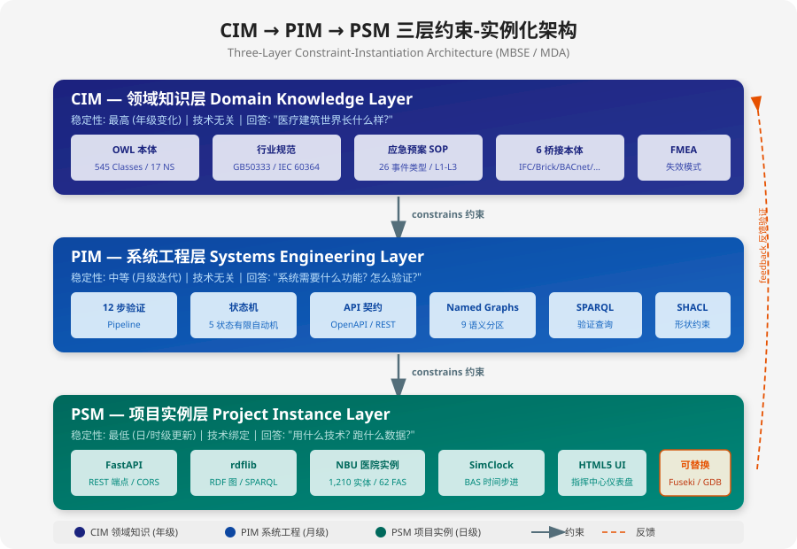
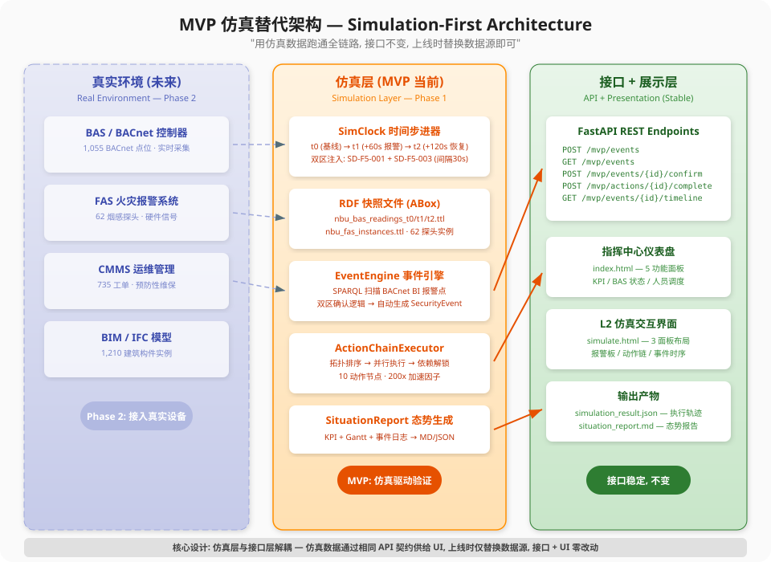
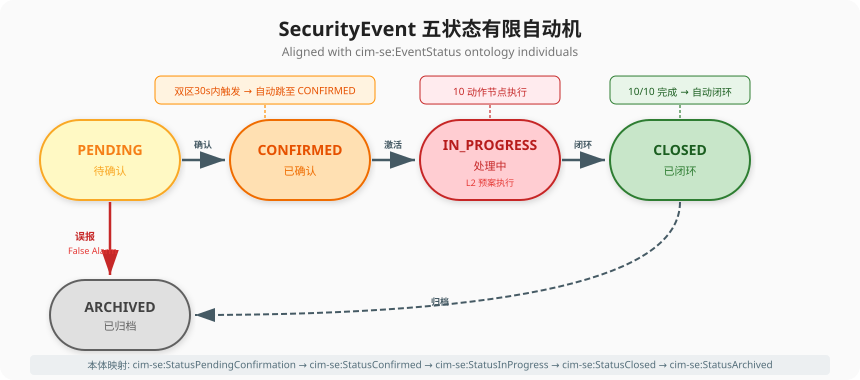
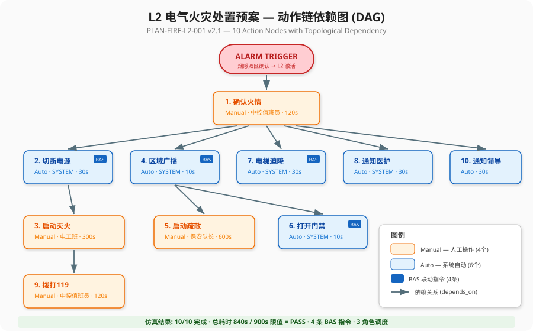
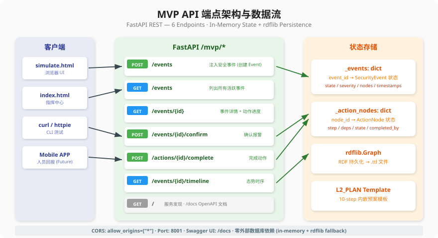
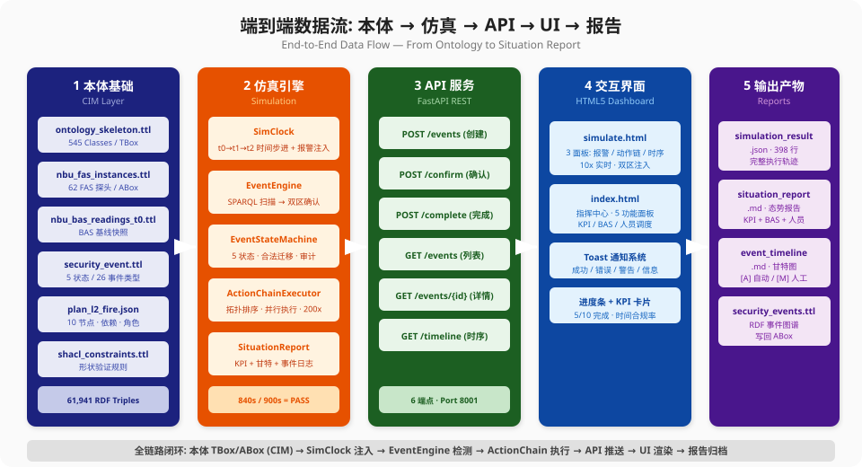

# 医疗建筑 CIM 统一领域模型 — MVP 技术白皮书

**CIM Unified Domain Model for Healthcare Buildings — MVP Technical Whitepaper**

| 属性 | 值 |
|------|------|
| 文档编号 | CIMU-FOUND-WP-MVP-01 |
| 版本 | v1.0.0 |
| 日期 | 2026-05-22 |
| 状态 | Released |
| 本体版本 | CIM v4.0.0 (545 OWL Classes, 61,941 RDF Triples) |
| MVP 场景 | L2 级电气火灾处置 (烟感报警 → SOP 执行 → 闭环归档) |

---

## 目录

1. [引言: 为什么需要 MVP](#1-引言-为什么需要-mvp)
2. [CIM-PIM-PSM 三层架构与约束传播](#2-cim-pim-psm-三层架构与约束传播)
3. [MVP 核心设计: 仿真替代真实环境](#3-mvp-核心设计-仿真替代真实环境)
4. [本体基础: 从 TBox 到 ABox](#4-本体基础-从-tbox-到-abox)
5. [仿真引擎: SimClock 与 EventEngine](#5-仿真引擎-simclock-与-eventengine)
6. [SOP 实现: 五状态机与十节点动作链](#6-sop-实现-五状态机与十节点动作链)
7. [API 设计: 6 端点 RESTful 契约](#7-api-设计-6-端点-restful-契约)
8. [前端交互: 指挥中心与仿真界面](#8-前端交互-指挥中心与仿真界面)
9. [验证结果与 KPI](#9-验证结果与-kpi)
10. [从 MVP 到生产: 演进路径](#10-从-mvp-到生产-演进路径)
11. [结论](#11-结论)

---

## 1. 引言: 为什么需要 MVP

### 1.1 问题陈述

医疗建筑是最复杂的建筑类型之一。它不是静态的物理容器, 而是 **24/7 持续运行的动态系统**, 涉及 HVAC、电气、给排水、消防、医疗气体五大技术系统, 以及手术调度、应急响应、设备维护等数十个并行业务流程。

传统的 BIM (Building Information Modeling) 擅长描述 **"建筑长什么样"** (几何 + 属性), 但无法回答:

- 烟感报警后, 系统应该自动做什么? 人应该做什么? 按什么顺序?
- BAS 联动指令 (切断电源、广播、电梯迫降) 是否在时限内完成?
- 事件状态如何从 "待确认" 走到 "已闭环"? 每一步由谁执行、耗时多久?

**CIM (Common Information Model) 统一领域模型** 正是为了回答这些问题而设计。它不仅建模 "物理世界是什么样的" (本体 TBox), 还建模 "发生了什么" (实例 ABox)、"应该怎么做" (SOP/预案)、以及 "做得怎么样" (KPI/验证)。

### 1.2 MVP 的战略定位

MVP 不是简化版本, 而是 **全链路最小闭环验证**:

> 用仿真数据跑通从本体定义到前端展示的完整数据链路,
> 证明 CIM-PIM-PSM 三层架构在真实业务场景中可行,
> 且接口契约稳定 —— 上线时仅替换数据源, 接口 + UI 零改动。

**选择的验证场景: L2 级电气火灾处置 (烟感报警)**

这一场景覆盖了 CIM 的核心能力:

| 能力维度 | MVP 中的体现 |
|----------|-------------|
| 本体建模 (CIM) | 545 OWL Classes, 26 安全事件类型, 62 FAS 探头实例 |
| 状态管理 (PIM) | 5 状态有限自动机, 合法迁移约束, 审计轨迹 |
| SOP 执行 (PIM) | 10 节点动作链, 拓扑依赖, 角色分派, 时限约束 |
| 仿真替代 (PSM) | SimClock 时间步进, RDF 快照注入, 双区确认逻辑 |
| API 契约 (PIM→PSM) | 6 RESTful 端点, OpenAPI 文档, CORS |
| 前端展示 (PSM) | 3 面板仿真界面, 指挥中心仪表盘, 实时进度 |
| 验证闭环 | 10/10 动作完成, 840s < 900s 限值, 4 BAS 指令 |


*图 1: CIM-PIM-PSM 三层约束-实例化架构*

---

## 2. CIM-PIM-PSM 三层架构与约束传播

### 2.1 核心认知: 三个抽象层级, 不是三个文件

CIM、PIM、PSM 不是三个独立的产出物, 而是 **同一系统的三个抽象层级**, 它们之间是 **约束-实例化** 关系 (非并行装配):

```
CIM (最稳定, 年级变化) ──── 领域知识: "医疗建筑世界长什么样?"
 │ constrains (约束)
 v
PIM (中等稳定, 月级迭代) ── 系统工程: "系统需要什么功能? 怎么验证?"
 │ constrains (约束)
 v
PSM (最易变, 日/时级更新) ── 项目实例: "用什么技术? 跑什么数据?"
```

### 2.2 三层定义

#### CIM — 领域知识层 (Domain Knowledge Layer)

CIM 层是形式化的领域知识和行业惯例, 通过本体和知识图谱表达。它回答 **"医疗建筑世界长什么样?"**, 独立于任何技术平台。

**在 MVP 中的具体体现:**

| 产物 | 文件 | 说明 |
|------|------|------|
| OWL 本体骨架 | `ontology_skeleton.ttl` | 545 类, 17 命名空间, ISO 19650 五层结构 |
| FAS 探头实例 | `nbu_fas_instances.ttl` | 62 个烟感/温感探头, 含区域划分 |
| 安全事件本体 | `security_event.ttl` | 5 状态, 26 事件类型, cim-se 命名空间 |
| BAS 基线快照 | `nbu_bas_readings_t0.ttl` | 1,055 BACnet 点位的正常状态值 |
| 处置预案 | `plan_l2_electrical_fire.json` | 10 节点, 依赖关系, 角色, 时限, BAS 指令 |
| 6 桥接本体 | `bridge_*.ttl` | IFC/Brick/ASHRAE223P/FSO/BACnet/ISO14224 |

#### PIM — 系统工程层 (Systems Engineering Layer)

PIM 层是 CIM 的工程化: 面向领域的系统方法、逻辑、组件、模块。它回答 **"系统需要什么功能? 怎么验证?"**, 同样独立于技术平台。

**在 MVP 中的具体体现:**

| 产物 | 说明 |
|------|------|
| 5 状态有限自动机 | PENDING → CONFIRMED → IN_PROGRESS → CLOSED → ARCHIVED |
| 合法迁移矩阵 | 每个状态只能迁移到指定的下一状态 (含误报快捷路径) |
| 10 节点 DAG | 拓扑排序 + 依赖解锁 + 并行执行 + 时限约束 |
| API 契约 (OpenAPI) | 6 端点定义, 请求/响应模型, 状态码, 幂等性 |
| SPARQL 验证 | 双区确认查询, 事件完整性检查, BAS 联动验证 |
| 角色-权限模型 | R1-R5 五级权限, 4 角色 (中控/电工/保安/系统) |

#### PSM — 项目实例层 (Project Instance Layer)

PSM 层是 PIM 的实例化: 技术选型、实现代码、数据加载。它回答 **"用什么技术? 跑什么数据?"**

**在 MVP 中的具体体现:**

| 技术选择 | 说明 | 可替换为 |
|----------|------|---------|
| FastAPI (Python) | REST 端点 + CORS + OpenAPI | Spring Boot, Express.js |
| rdflib | RDF 图操作 + SPARQL | Apache Jena Fuseki, GraphDB |
| In-Memory Dict | 事件/动作状态存储 | PostgreSQL, Redis |
| HTML5 + Vanilla JS | 指挥中心仪表盘 | React, Vue.js |
| SimClock | BAS 时间步进仿真 | 真实 BACnet 控制器 |

### 2.3 约束传播: 从知识到代码

CIM-PIM-PSM 之间不是简单的 "上层设计、下层实现", 而是严格的 **约束传播**:

**CIM 约束 PIM:**
- 本体定义 "安全事件有 5 个状态" → PIM 状态机 **必须** 实现全部 5 个迁移
- 本体定义 "烟感探头属于 FAS 区域" → PIM 双区确认逻辑 **必须** 按区域聚合

**PIM 约束 PSM:**
- PIM 定义 "6 个 API 端点" → PSM FastAPI **必须** 实现每个端点
- PIM 定义 "10 节点拓扑排序" → PSM ActionChainExecutor **必须** 遵循依赖关系

**PSM 可替换:**
- 同一 CIM + PIM 可映射到不同医院 (NBU → ZJU)
- 同一 CIM + PIM 可映射到不同技术栈 (FastAPI → Spring Boot, rdflib → Fuseki)

### 2.4 MVP 中的 CIM-PIM-PSM 映射实例

以 "烟感报警确认" 这一业务场景为例:

| CIM (领域知识) | PIM (系统工程) | PSM (技术实现) |
|----------------|----------------|----------------|
| `cim-se:FireEvent` 是 `cim-se:SecurityEvent` 的子类 | 事件创建时分配 `event_type="FireEvent"` | `EventCreateRequest.trigger_device="SD-F5-001"` |
| `cim-se:StatusPendingConfirmation` → `cim-se:StatusConfirmed` | 双区30秒内触发 → 自动跳过 PENDING | `if req.dual_zone: state="CONFIRMED"` |
| `cim-fas:SmokeDetector` 属于 `cim-fas:FASZone` | SPARQL 查询按 zone 聚合报警探头 | `SELECT ?point WHERE { ?point cim-bn:bacnetPointOf ?equip }` |
| `cim-se:ActionChain` 含 `cim-se:ActionNode` 集合 | 拓扑排序: `depends_on` 定义 DAG | `L2_PLAN = [{"step": 1, "deps": [], ...}]` |
| `cim-se:EventStatus` 有 5 个 individual | `VALID_TRANSITIONS` 字典定义合法迁移 | `class EventStatus(Enum): PENDING = "待确认"` |

---

## 3. MVP 核心设计: 仿真替代真实环境

### 3.1 设计哲学: Simulation-First

MVP 的核心设计决策是 **仿真优先 (Simulation-First)**: 用仿真数据完全替代真实设备信号, 但保持与生产环境完全一致的接口契约。

```
┌──────────────────────────────────────────────────────────┐
│  真实环境 (Phase 2)          仿真层 (MVP Phase 1)        │
│  ──────────────              ─────────────────           │
│  BAS BACnet 控制器    ←→     SimClock (RDF 快照注入)     │
│  FAS 火灾报警面板     ←→     RDF ABox 实例文件           │
│  CMMS 运维系统        ←→     YAML 工单数据              │
│  BIM/IFC 模型         ←→     TTL 建筑构件实例           │
│                                                          │
│  数据源不同, 但 API 端点 + 数据模型 完全相同              │
│  上线时仅替换数据源, 接口 + UI 零改动                    │
└──────────────────────────────────────────────────────────┘
```


*图 2: 仿真替代架构 — 仿真层与接口层解耦*

### 3.2 仿真层的三个核心组件

| 组件 | 文件 | 职责 |
|------|------|------|
| **SimClock** | `engine/sim_clock.py` | BAS 快照时间步进: t0 (基线) → t1 (+60s 报警) → t2 (+120s 恢复) |
| **EventEngine** | `engine/event_engine.py` | SPARQL 扫描 BACnet BI 报警点, 双区确认, 生成 SecurityEvent |
| **ActionChainExecutor** | `engine/action_chain_executor.py` | 拓扑排序 10 节点, 并行执行, 依赖解锁, 200x 加速 |

### 3.3 仿真与真实的接口等价性

仿真层的输出格式与真实环境完全一致:

| 数据类型 | 仿真来源 | 真实来源 | 格式 |
|----------|---------|---------|------|
| 烟感报警信号 | SimClock 注入 `hasPresentValue=true` | BACnet BI 点位 | RDF Turtle |
| 安全事件 | EventEngine SPARQL 生成 | FAS 面板 + BAS 联动 | JSON (REST API) |
| 动作执行状态 | ActionChainExecutor 仿真 | 人员 APP 回报 | JSON (REST API) |
| BAS 联动指令 | 模拟发送 (日志记录) | BACnet Write 命令 | JSON |
| 态势报告 | SituationReport 自动生成 | SituationReport (相同代码) | Markdown + JSON |

**关键性质**: 当仿真层被替换为真实设备接口时, API 端点的请求/响应格式不变, 前端代码不需要任何修改。

---

## 4. 本体基础: 从 TBox 到 ABox

### 4.1 本体架构总览

CIM 本体采用 ISO 19650 启发的五层结构:

```
Layer 4: 运营扩展 (95 classes, ~1,100 triples)
  控制策略 / 安全事件 / FAS / CMMS
  ↓
Layer 3: 设计本体 (65 classes, ~780 triples)
  性能指标 / 设计规范 / GB50333 硬编码值
  ↓
Layer 2: 参考本体 (180 classes, ~1,800 triples)
  标准分类 / PDT 属性定义
  ↓
Layer 1: 概念本体 (45 classes, ~520 triples)
  介质 / 连接点 / 数据点 / 设备 / 空间 / 流
  ↓
Layer 0: BFO 基础 (12 classes, ~180 triples)
  Continuant / Occurrent 范畴
```

### 4.2 MVP 涉及的核心本体元素

**安全事件命名空间 (cim-se)**

```turtle
@prefix cim-se: <https://cim.medical/ontology/v4.0/security_event#> .

cim-se:SecurityEvent rdfs:subClassOf bfo:Process .    # BFO Occurrent
cim-se:FireEvent     rdfs:subClassOf cim-se:SecurityEvent .

# 5 状态 individuals
cim-se:StatusPendingConfirmation a cim-se:EventStatus .
cim-se:StatusConfirmed           a cim-se:EventStatus .
cim-se:StatusInProgress          a cim-se:EventStatus .
cim-se:StatusClosed              a cim-se:EventStatus .
cim-se:StatusArchived            a cim-se:EventStatus .

# 动作链
cim-se:ActionChain rdfs:subClassOf bfo:Process .
cim-se:ActionNode  rdfs:subClassOf bfo:ProcessBoundary .
```

**FAS 命名空间 (cim-fas)**

```turtle
@prefix cim-fas: <https://cim.medical/ontology/v4.0/fas#> .

cim-fas:SmokeDetector  rdfs:subClassOf cim:FireProtectionEquipment .
cim-fas:FASZone        rdfs:subClassOf cim:Zone .
cim-fas:hasDetector    a owl:ObjectProperty ;
                       rdfs:domain cim-fas:FASZone ;
                       rdfs:range  cim-fas:SmokeDetector .
```

### 4.3 ABox 实例: NBU 医院

MVP 使用一所虚拟医疗机构 (NBU Medical Clinic) 的完整实例数据:

| ABox 文件 | 实例数 | 说明 |
|-----------|--------|------|
| `nbu_medical_clinic_instances.ttl` | 1,210 | IFC 建筑构件 (空间/设备/系统) |
| `nbu_fas_instances.ttl` | 62 | FAS 烟感/温感探头 + 区域划分 |
| `nbu_bas_readings_t0.ttl` | 1,055 | BAS 基线读数 (全部 NORMAL) |
| `nbu_bas_readings_t1.ttl` | 1,055+ | BAS 报警状态 (SimClock 注入后) |
| `nbu_bas_readings_t2.ttl` | 1,055 | BAS 恢复状态 (报警清除后) |
| `nbu_cmms_workorders.ttl` | 735 | CMMS 维修工单 |
| `nbu_security_events.ttl` | 动态 | EventEngine 生成的安全事件 |

### 4.4 Named Graphs: 9 个语义分区

CIM 知识图谱使用 Named Graphs 实现数据源隔离:

```
Graph 1: IFC 建筑模型        (设计层 — Continuant)
Graph 2: BAS 实时读数        (运行层 — Occurrent)
Graph 3: FAS 消防实例        (安全层)
Graph 4: CMMS 运维工单       (维护层)
Graph 5: 安全事件            (事件层 — Occurrent)
Graph 6: 控制策略            (控制层)
Graph 7: 设计参数            (设计规范层)
Graph 8: 桥接映射            (标准互操作层)
Graph 9: 验证结果            (质量保证层)
```

**BFO 双重性在 MVP 中的体现:**

- **Continuant 视角** (设计层): "62 个烟感探头安装在什么位置? 属于哪个 FAS 区域?"
- **Occurrent 视角** (运行层): "哪个探头在 t1 时刻报警了? 事件状态经历了哪些迁移?"

跨 Named Graph 的比较使得 MVP 能够将设计时的 "应然" 与运行时的 "实然" 进行对照。

---

## 5. 仿真引擎: SimClock 与 EventEngine

### 5.1 SimClock: BAS 快照时间步进

SimClock 是 MVP 仿真层的核心组件。它管理 BAS 快照文件的时间步进, 并在指定时刻注入烟感报警信号。

**时间线:**

```
t0  [基线]     所有探头 NORMAL, 所有读数稳态
 │
 │ +60s
 v
t1  [报警]     SD-2F-OR-01 报警注入 (单探头, PENDING)
 │
 │ +30s
 v
t1' [双区]     SD-2F-OR-03 报警注入 (双区, 自动 CONFIRMED)
 │
 │ +120s
 v
t2  [恢复]     所有报警点清除, 恢复 NORMAL
```

**报警注入机制:**

SimClock 直接修改 RDF 快照文件中的 BACnet Binary Input 点位:

```turtle
# 注入前 (t0)
bas:SD_2F_OR_01_SMKDET_BI
    a                       cim-bacnet:BACnetBinaryInput ;
    cim-bacnet:hasPresentValue  "false"^^xsd:boolean ;
    cim-bacnet:hasStatusFlags   "NORMAL" .

# 注入后 (t1)
bas:SD_2F_OR_01_SMKDET_BI
    cim-bacnet:hasPresentValue  "true"^^xsd:boolean ;
    cim-bacnet:hasStatusFlags   "IN-ALARM" .
```

**双区确认逻辑:**

当同一 FAS Zone 内的两个探头在 30 秒窗口内先后报警时, 系统自动将事件从 PENDING 升级为 CONFIRMED, 跳过人工确认步骤。这是消防行业的标准做法, 用于减少误报。

```python
ALARM_TARGETS = {
    "t1_primary":   {"equip_id": "SD-2F-OR-01", "delay": 0},   # 主探头, 立即
    "t1_secondary": {"equip_id": "SD-2F-OR-03", "delay": 30},  # 辅探头, 30s 后
}
```

### 5.2 EventEngine: SPARQL 驱动的事件生成

EventEngine 对 BAS 快照执行 SPARQL 查询, 扫描所有 BACnet Binary Input 点位, 发现 `hasPresentValue=true` 的报警点, 并生成 SecurityEvent 实例。

**核心查询:**

```sparql
PREFIX cim-bn: <https://cim.medical/ontology/v4.0/bacnet#>
SELECT ?point ?equip WHERE {
    ?point a cim-bn:BACnetBinaryInput ;
           cim-bn:hasPresentValue "true"^^xsd:boolean ;
           cim-bn:bacnetPointOf ?equip .
}
```

**处理流程:**

```
SPARQL 扫描 BACnet BI
  │
  ├── 发现 1 个报警点 → 生成 SecurityEvent (state=PENDING)
  │
  └── 发现 2+ 报警点 (同 zone, 30s 内)
        → 生成 SecurityEvent (state=CONFIRMED)
        → 自动激活 L2 预案
```

### 5.3 ActionChainExecutor: 拓扑排序与并行执行

ActionChainExecutor 接收 L2 预案定义 (10 节点 DAG), 通过拓扑排序确定执行顺序, 并在依赖满足时并行执行多个动作。

**执行策略:**

- **自动动作 (Auto)**: 模拟耗时 = 时限 × 30% (系统快速执行)
- **人工动作 (Manual)**: 模拟耗时 = 时限 × 70% (人工操作需要更多时间)
- **加速因子**: 200x (840 秒仿真时间 → 0.201 秒真实时间)

---

## 6. SOP 实现: 五状态机与十节点动作链

### 6.1 五状态有限自动机

SecurityEvent 的生命周期由一个 5 状态有限自动机管理, 每个状态直接映射到本体中的 `cim-se:EventStatus` individual。


*图 3: SecurityEvent 五状态有限自动机*

**状态定义:**

| 状态 | 本体映射 | 中文 | 说明 |
|------|---------|------|------|
| `PENDING` | `cim-se:StatusPendingConfirmation` | 待确认 | 单探头报警, 等待人工或双区确认 |
| `CONFIRMED` | `cim-se:StatusConfirmed` | 已确认 | 火情确认, L2 预案激活 |
| `IN_PROGRESS` | `cim-se:StatusInProgress` | 处理中 | 10 节点动作链执行中 |
| `CLOSED` | `cim-se:StatusClosed` | 已闭环 | 10/10 动作完成, 事件闭环 |
| `ARCHIVED` | `cim-se:StatusArchived` | 已归档 | 事件归档, 进入历史记录 |

**合法迁移矩阵:**

```python
VALID_TRANSITIONS = {
    PENDING:     [CONFIRMED, ARCHIVED],    # 确认 或 误报
    CONFIRMED:   [IN_PROGRESS],            # 激活预案
    IN_PROGRESS: [CLOSED],                 # 全部完成
    CLOSED:      [ARCHIVED],               # 归档
    ARCHIVED:    [],                        # 终态
}
```

**误报快捷路径:** PENDING → ARCHIVED (跳过所有中间状态), 用于值班员确认为误报时直接归档。

**审计轨迹:** 每次状态迁移记录 `{from, to, timestamp}`, 确保事后可追溯。

### 6.2 十节点动作链 (L2 电气火灾处置预案)

L2 预案定义了 10 个动作节点, 形成一个有向无环图 (DAG), 通过 `depends_on` 字段定义依赖关系。


*图 4: L2 电气火灾处置预案 — 10 节点依赖图*

**完整动作链定义:**

| # | 动作 | 角色 | 模式 | 时限 | 依赖 | BAS 指令 |
|---|------|------|------|------|------|---------|
| 1 | 确认火情 | 中控值班员 | Manual | 120s | — | — |
| 2 | 切断电源 | SYSTEM | Auto | 30s | [1] | PowerCutoff |
| 3 | 启动灭火 | 电工班 | Manual | 300s | [2] | — |
| 4 | 区域广播 | SYSTEM | Auto | 10s | [1] | Broadcast |
| 5 | 启动疏散 | 保安队长 | Manual | 600s | [4] | — |
| 6 | 打开门禁 | SYSTEM | Auto | 10s | [4] | DoorRelease |
| 7 | 电梯迫降 | SYSTEM | Auto | 30s | [1] | ElevatorRecall |
| 8 | 通知医护 | SYSTEM | Auto | 30s | [1] | — |
| 9 | 拨打 119 | 中控值班员 | Manual | 120s | [3] | — |
| 10 | 通知领导 | SYSTEM | Auto | 30s | [1] | — |

**DAG 并行性分析:**

- **Layer 0** (无依赖): Step 1 (确认火情)
- **Layer 1** (依赖 Step 1): Steps 2, 4, 7, 8, 10 — 可并行
- **Layer 2** (依赖 Steps 2 或 4): Steps 3, 5, 6 — 可并行
- **Layer 3** (依赖 Step 3): Step 9

**关键路径**: 1 → 2 → 3 → 9 (总时限: 120 + 30 + 300 + 120 = 570s)
**最长路径**: 1 → 4 → 5 (总时限: 120 + 10 + 600 = 730s)
**L2 硬限值**: 900 秒

### 6.3 角色与权限

```json
{
  "ControlRoomOperator": {"label": "中控值班员", "permission": "R2"},
  "SecurityTeamLeader":  {"label": "保安队长",   "permission": "R2"},
  "ElectricalTechnician":{"label": "电工班",     "permission": "R1"},
  "SYSTEM":              {"label": "系统自动",   "permission": "AUTO"}
}
```

**执行模式:**

- **AutomaticExecution**: 系统收到依赖完成信号后自动执行, 无需人工干预 (6 个)
- **ManualConfirmation**: 需要人工确认后执行 (2 个: 确认火情、拨打 119)
- **ManualExecution**: 需要人工到场执行 (2 个: 启动灭火、启动疏散)

### 6.4 BAS 联动指令

MVP 仿真中发出 4 条 BAS 联动指令:

| 指令 | 触发动作 | 目标设备 | 效果 |
|------|---------|---------|------|
| `PowerCutoffCommand` | Step 2 切断电源 | 配电室断路器 | 切断火灾区域电力供应 |
| `BroadcastCommand` | Step 4 区域广播 | 公共广播系统 | 播放疏散指令 |
| `ElevatorRecallCommand` | Step 7 电梯迫降 | 电梯控制器 | 所有电梯归首层 |
| `DoorReleaseCommand` | Step 6 打开门禁 | 门禁控制器 | 释放火灾区域所有门禁 |

---

## 7. API 设计: 6 端点 RESTful 契约

### 7.1 架构决策

| 决策 | 选择 | 原因 |
|------|------|------|
| 框架 | FastAPI | 自动 OpenAPI 文档, Pydantic 验证, 异步支持 |
| 状态存储 | In-Memory Dict | MVP 无需持久化, 降低部署复杂度 |
| 持久化 | rdflib Graph | RDF 三元组写回 .ttl 文件 |
| 跨域 | CORS allow_origins=["*"] | 前端文件直接打开, 无需部署 |
| 端口 | 8001 | 避免与现有 M4/M5 平台 (8000) 冲突 |

### 7.2 端点清单


*图 5: MVP API 端点架构与数据流*

#### EP-1: 创建安全事件

```
POST /mvp/events
```

**请求体:**
```json
{
  "trigger_device": "SD-F5-001",
  "zone": "FAS-ZONE-05",
  "severity": "L2",
  "dual_zone": true,
  "notes": "仿真演练"
}
```

**响应:**
```json
{
  "event_id": "EVT-20260522-001",
  "state": "CONFIRMED",
  "nodes_created": 10,
  "auto_completed": ["cut_power", "broadcast", "elevator_home", "notify_medical", "notify_leaders"],
  "message": "SecurityEvent EVT-20260522-001 created. State=CONFIRMED."
}
```

**设计要点:**
- `dual_zone=true` 时自动跳过 PENDING, 直接 CONFIRMED
- CONFIRMED 后立即自动执行所有依赖 Step 1 的系统动作

#### EP-2: 列出活跃事件

```
GET /mvp/events
```

**响应:**
```json
{
  "total": 1,
  "events": [
    {
      "event_id": "EVT-20260522-001",
      "state": "CONFIRMED",
      "severity": "L2",
      "trigger_device": "SD-F5-001",
      "zone": "FAS-ZONE-05",
      "progress": "5/10"
    }
  ]
}
```

#### EP-3: 事件详情

```
GET /mvp/events/{event_id}
```

返回完整事件信息 + 全部 10 个动作节点的当前状态。

#### EP-4: 确认报警

```
POST /mvp/events/{event_id}/confirm
```

将事件从 PENDING 迁移到 CONFIRMED, 并激活 L2 预案。仅在非双区触发 (单探头) 时需要此端点。

#### EP-5: 完成动作

```
POST /mvp/actions/{node_id}/complete
```

**请求体:**
```json
{
  "completed_by": "ELEC-DUTY-001",
  "notes": "灭火器已使用, 明火扑灭"
}
```

**设计要点:**
- 完成一个动作后自动解锁依赖该动作的下游节点
- 系统动作自动立即完成
- 10/10 完成时自动触发事件闭环 (CLOSED_LOOP)

#### EP-6: 事件时序

```
GET /mvp/events/{event_id}/timeline
```

返回时间排序的完整事件日志, 用于前端 "态势时序" 面板渲染。

### 7.3 API 契约的稳定性保证

API 契约位于 PIM 层, 独立于底层数据源:

```
Phase 1 (MVP):   SimClock → In-Memory Dict → FastAPI → JSON
Phase 2 (Pilot): BACnet   → PostgreSQL     → FastAPI → JSON  (API 不变)
Phase 3 (Prod):  BACnet   → TimescaleDB    → FastAPI → JSON  (API 不变)
```

前端代码调用的 URL、请求格式、响应结构在三个阶段完全相同。

---

## 8. 前端交互: 指挥中心与仿真界面

### 8.1 指挥中心仪表盘 (index.html)

指挥中心提供 5 个功能面板:

| 面板 | 功能 | 数据来源 |
|------|------|---------|
| 事件面板 | 活跃事件列表, 状态徽章, 严重等级 | GET /mvp/events |
| 预案面板 | L2 预案动作表, 进度条, 状态图标 | GET /mvp/events/{id} |
| 态势面板 | 时间线, KPI 卡片, BAS 状态 | GET /mvp/events/{id}/timeline |
| 调度面板 | 人员状态 (值班员/电工/保安/领导) | 内嵌数据 |
| 设置面板 | 仿真速度, 演练控制 (启动/暂停/重置) | 本地状态 |

### 8.2 L2 仿真交互界面 (simulate.html)

仿真界面采用 3 面板布局, 提供完整的交互式仿真体验:

**Panel 1 — 报警板 (左侧):**
- 事件列表: 显示所有报警事件及状态
- 报警注入表单: 选择探头 (SD-F5-001 / SD-F5-003 / SD-F3-007)、区域、双区开关
- 注入按钮: 手动触发报警

**Panel 2 — L2 动作执行 (中间):**
- 总体进度条: 实时百分比 + 完成数 (如 "5/10 steps completed")
- 步骤列表: 编号、名称、角色、状态徽章 (PENDING/EXECUTING/COMPLETED)
- 完成按钮: 人工动作需要点击 "完成" 按钮
- 自动动作: 系统动作在时限 30% 时自动完成

**Panel 3 — 事件时序 (右侧):**
- 彩色时间线: 每个事件一个圆点 (ALARM=红, CONFIRMED=橙, COMPLETED=绿, CLOSED=蓝)
- 自动滚动: 新事件出现时自动滚动到底部
- 事件计数: 显示时间线条目总数

**仿真参数:**
- Tick 间隔: 100ms 真实时间 = 1 秒仿真时间 (10x 加速)
- 双区确认: 1.5 秒真实时间 = 15 秒仿真时间后自动确认
- 状态栏: 显示当前状态、进度、仿真时钟

---

## 9. 验证结果与 KPI

### 9.1 仿真执行结果

MVP 仿真运行的完整结果记录在 `output/simulation_result.json` 中:

| KPI | 值 | 判定 |
|-----|-----|------|
| 动作完成率 | 10/10 (100%) | PASS |
| 总仿真耗时 | 840 秒 | — |
| L2 时限 | 900 秒 | — |
| 时限合规 | 840 < 900 | PASS |
| 真实执行时间 | 0.201 秒 | — |
| BAS 指令发出 | 4 条 | PASS |
| 角色调度 | 3 角色 | PASS |
| 状态迁移 | 4 次 (PENDING→CONFIRMED→IN_PROGRESS→CLOSED) | PASS |

### 9.2 各动作执行明细

| # | 动作 | 模式 | 时限 | 实际耗时 | 合规 |
|---|------|------|------|---------|------|
| 1 | 确认火情 | Manual | 120s | 84s | PASS |
| 2 | 切断电源 | Auto | 30s | 9s | PASS |
| 3 | 启动灭火 | Manual | 300s | 210s | PASS |
| 4 | 区域广播 | Auto | 10s | 3s | PASS |
| 5 | 启动疏散 | Manual | 600s | 420s | PASS |
| 6 | 打开门禁 | Auto | 10s | 3s | PASS |
| 7 | 电梯迫降 | Auto | 30s | 9s | PASS |
| 8 | 通知医护 | Auto | 30s | 9s | PASS |
| 9 | 拨打 119 | Manual | 120s | 84s | PASS |
| 10 | 通知领导 | Auto | 30s | 9s | PASS |

### 9.3 端到端数据流验证


*图 6: 端到端数据流 — 从本体到态势报告*

**全链路闭环验证:**

```
本体 TBox/ABox (545 classes, 61,941 triples)
  → SimClock 报警注入 (t0→t1, 双区)
    → EventEngine SPARQL 扫描 (发现 2 报警点)
      → SecurityEvent 创建 (state=CONFIRMED)
        → L2 预案激活 (10 节点 DAG)
          → ActionChainExecutor 拓扑执行 (200x)
            → API 推送 (6 端点)
              → UI 渲染 (3 面板)
                → SituationReport 生成 (MD + JSON)
                  → security_events.ttl 写回 ABox
```

每一步的输出格式均与生产环境一致, 验证了 CIM-PIM-PSM 架构的可行性。

---

## 10. 从 MVP 到生产: 演进路径

### 10.1 三阶段演进

| 阶段 | 数据源 | 存储 | 前端 | API |
|------|--------|------|------|-----|
| **Phase 1: MVP** (当前) | SimClock (RDF 快照) | In-Memory Dict | HTML5 Static | FastAPI :8001 |
| **Phase 2: Pilot** | BACnet Gateway + FAS | PostgreSQL + rdflib | HTML5 + WebSocket | FastAPI :8001 (不变) |
| **Phase 3: Production** | 全量 BACnet + CMMS | TimescaleDB + Fuseki | React + Grafana | FastAPI :8001 (不变) |

### 10.2 Phase 1 → Phase 2 的具体变更

| 组件 | MVP (Phase 1) | Pilot (Phase 2) | 变更量 |
|------|---------------|-----------------|--------|
| 报警信号 | SimClock 注入 .ttl | BACnet BI 点位轮询 | 替换 SimClock → BACnet Client |
| 事件创建 | EventEngine SPARQL | FAS 面板 + BACnet 事件 | 替换 EventEngine → FAS Adapter |
| 动作完成 | 仿真自动完成 | 人员 APP 回报 | 替换仿真 → Mobile API Client |
| BAS 联动 | 日志记录 (模拟) | BACnet Write 命令 | 替换日志 → BACnet Write Client |
| 状态存储 | In-Memory Dict | PostgreSQL | 替换 Dict → ORM |
| API 端点 | **不变** | **不变** | **0 改动** |
| 前端 UI | **不变** | **不变** (+ WebSocket 推送) | **+1 个 WS 端点** |

### 10.3 PSM 可替换性验证

MVP 已经通过 rdflib fallback 机制验证了 PSM 层的可替换性:

```
rdflib (Python, 内存) ←→ Apache Jena Fuseki (Java, 磁盘)
  ↑ MVP 使用                ↑ 生产候选
  
同一 SPARQL 查询, 同一结果, 不同引擎
```

---

## 11. 结论

### 11.1 MVP 证明了什么

1. **CIM-PIM-PSM 三层架构可行**: 从 545 类本体到前端仪表盘的完整数据链路已跑通, 约束传播机制有效
2. **仿真替代策略有效**: 仿真数据通过相同 API 契约供给 UI, 接口层和展示层与数据源完全解耦
3. **SOP 可执行**: 5 状态机 + 10 节点 DAG 完整覆盖 L2 电气火灾处置流程, 840s < 900s 限值
4. **API 契约稳定**: 6 端点定义明确, Phase 2/3 上线时仅替换数据源, 接口零改动
5. **本体-实例-业务 三元统一**: 本体定义 (TBox) → 医院实例 (ABox) → 业务逻辑 (状态机 + 动作链) 无缝衔接

### 11.2 关键数字

| 指标 | 值 |
|------|------|
| OWL 类定义 | 545 |
| RDF 三元组 | 61,941 |
| 命名空间 | 17 |
| 桥接本体 | 6 (IFC/Brick/ASHRAE223P/FSO/BACnet/ISO14224) |
| FAS 探头实例 | 62 |
| BACnet 点位 | 1,055 |
| 安全事件类型 | 26 |
| 状态机状态 | 5 |
| 动作节点 | 10 |
| BAS 联动指令 | 4 |
| API 端点 | 6 |
| 仿真耗时 | 840s / 900s 限值 |
| 动作完成率 | 100% (10/10) |

### 11.3 下一步

- **扩展场景**: 从 L2 电气火灾扩展到 L1 (一般) 和 L3 (重大) 级别预案
- **真实设备接入**: 通过 BACnet Gateway 替换 SimClock, 接入真实 FAS/BAS 信号
- **移动端**: 开发人员回报 APP, 替换仿真的自动完成逻辑
- **多事件并发**: 支持同时处理多个安全事件, 资源冲突检测
- **历史分析**: 基于归档事件的统计分析, 优化预案时限设置

---

## 附录: 插图索引

| 编号 | 标题 | 文件 |
|------|------|------|
| 图 1 | CIM-PIM-PSM 三层约束-实例化架构 | `svg/fig01_cim_pim_psm_architecture.svg` |
| 图 2 | MVP 仿真替代架构 | `svg/fig02_mvp_simulation_architecture.svg` |
| 图 3 | SecurityEvent 五状态有限自动机 | `svg/fig03_event_state_machine.svg` |
| 图 4 | L2 电气火灾处置预案动作链 DAG | `svg/fig04_l2_action_chain_dag.svg` |
| 图 5 | MVP API 端点架构与数据流 | `svg/fig05_api_architecture.svg` |
| 图 6 | 端到端数据流 | `svg/fig06_end_to_end_flow.svg` |

---

## 附录: 文件清单

```
project_deliverables/version02/mvp/
├── config/
│   └── plan_l2_electrical_fire.json        # L2 预案定义 (10 节点 DAG)
├── engine/
│   ├── event_state_machine.py              # 5 状态有限自动机
│   ├── action_chain_executor.py            # 拓扑排序 + 并行执行
│   ├── situation_report.py                 # 态势报告生成 (MD + Gantt)
│   ├── event_engine.py                     # SPARQL 事件扫描 + 双区确认
│   ├── sim_clock.py                        # BAS 快照时间步进
│   └── api_mvp_extension.py               # FastAPI 6 端点
├── scenario/
│   └── smoke_alarm_scenario.py             # 端到端仿真编排
├── platform/
│   ├── index.html                          # 指挥中心仪表盘
│   └── simulate.html                       # L2 仿真交互界面
└── output/
    ├── simulation_result.json              # 完整执行轨迹 (398 行)
    ├── situation_report.md                 # 态势报告 (94 行)
    └── event_timeline.md                   # 甘特图 (24 行)
```
