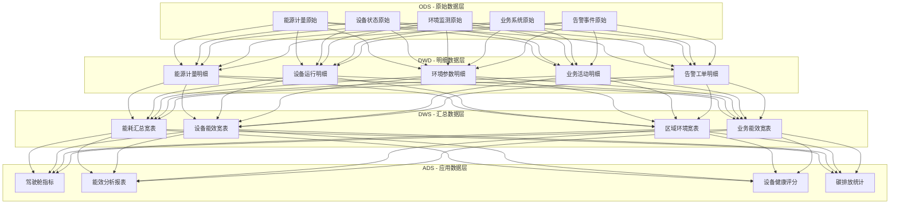
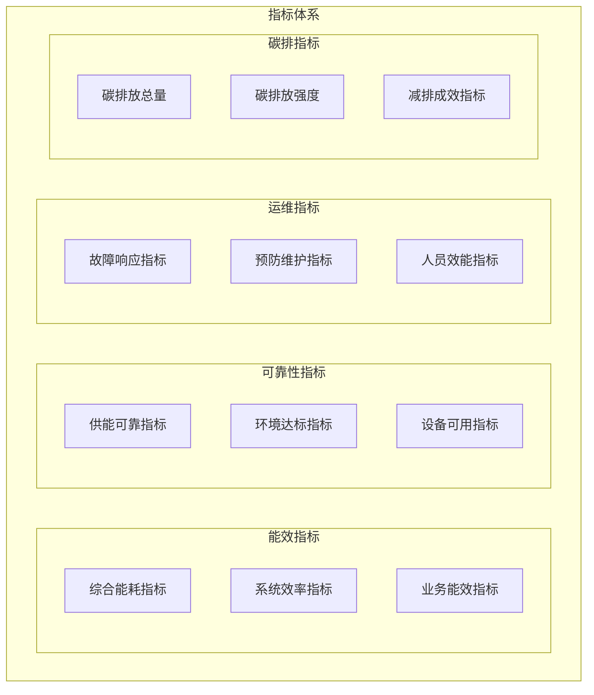
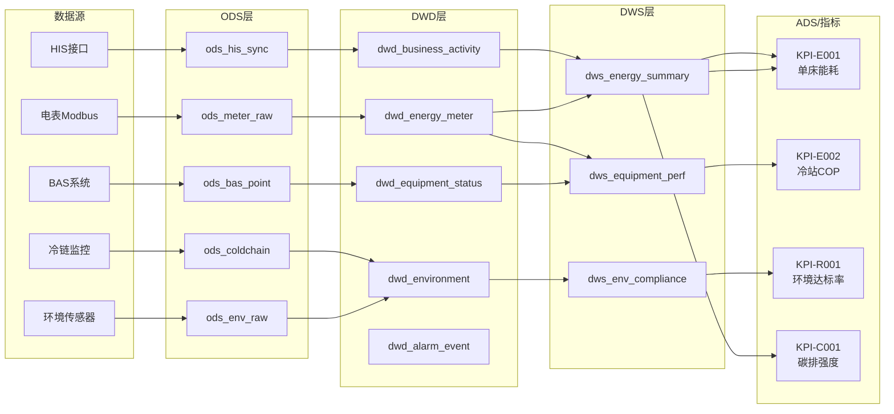
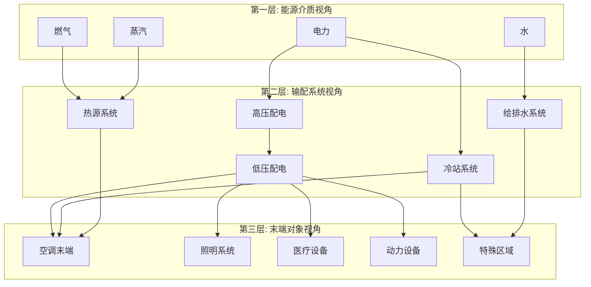
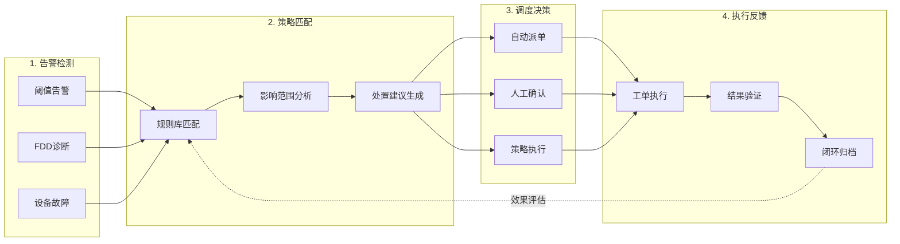
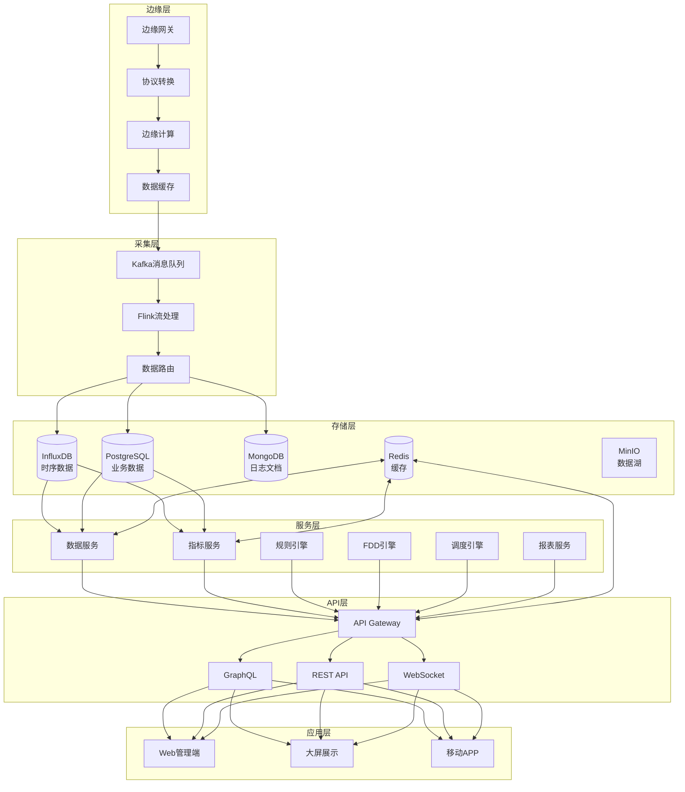
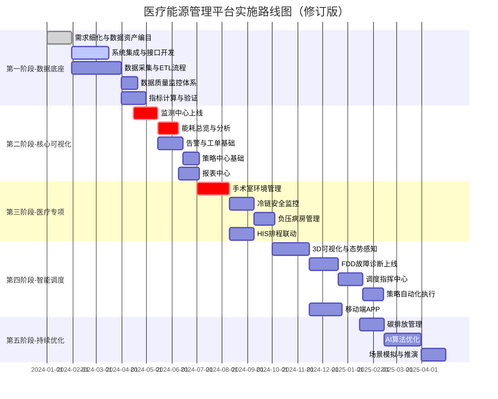

# 医疗建筑能源管理平台（修订版 v2.0）
## 完整功能规划与实施方案（修订版 v2.0）

---

## 修订说明

本版本基于审计意见进行了重大修订，核心改进包括：

| 审计问题 | 修订内容 | 章节位置 |
|----------|----------|----------|
| 系统集成清单缺失 | 新增完整系统集成清单表 | 第2章 |
| 数据模型与字典缺位 | 新增数据分层架构、数据字典 | 第3章 |
| 指标汇算逻辑不清 | 新增指标卡片、数据血缘图 | 第4章 |
| 可视化数据结构未定义 | 新增组件数据契约、API规范 | 第5章 |
| 能源流向展示不足 | 新增三层视角设计 | 第6章 |
| 调度闭环断裂 | 新增调度指挥中心设计 | 第7章 |
| 模块与ETL对接不清 | 新增模块×数据×接口矩阵 | 第8章 |

---

## 目录

1. [项目概述](#1-项目概述)
2. [系统集成规划](#2-系统集成规划)
3. [数据架构与数据字典](#3-数据架构与数据字典)
4. [指标体系与汇算逻辑](#4-指标体系与汇算逻辑)
5. [可视化数据契约](#5-可视化数据契约)
6. [能源流向与态势设计](#6-能源流向与态势设计)
7. [调度指挥中心设计](#7-调度指挥中心设计)
8. [功能模块与数据矩阵](#8-功能模块与数据矩阵)
9. [技术架构](#9-技术架构)
10. [实施路线图](#10-实施路线图)
11. [交付物清单](#11-交付物清单)

---

## 1. 项目概述

### 1.1 项目定位

构建以**数据驱动**为核心的医疗建筑能源管理平台，实现：
- **运营调度中枢**：统一监控、智能调度、闭环管理
- **智能决策支持**：数据分析、预测优化、策略推荐
- **合规保障体系**：环境记录、追溯审计、报告生成

### 1.2 核心目标量化

| 维度 | 指标 | 基准值 | 目标值 | 数据来源 |
|------|------|--------|--------|----------|
| 能效 | 单床日均能耗 | 95 kWh | <80 kWh | 电表+HIS床日数 |
| 能效 | 冷站综合COP | 3.8 | >4.5 | 冷量计+电表 |
| 可靠 | 关键区域环境达标率 | 95% | >99% | 环境传感器 |
| 可靠 | 供电可靠率 | 99.9% | 99.99% | 配电监控 |
| 运维 | 故障预警准确率 | 60% | >85% | FDD引擎+工单 |
| 运维 | 平均响应时间 | 45min | <15min | 工单系统 |
| 碳排 | 碳排放强度 | 45 kg/m² | <36 kg/m² | 能耗折算 |

---

## 2. 系统集成规划

### 2.1 系统集成清单

| 序号 | 系统名称 | 业务方 | 接口协议 | 数据内容 | 刷新频率 | 数据责任人 | 优先级 | 数据权属 |
|------|----------|--------|----------|----------|----------|------------|--------|----------|
| **能源计量类** |
| 1 | 高压配电监控 | 总务科 | Modbus TCP | 进线电量、功率、功率因数 | 1s | 电气主管 | P0-必采 | 医院自有 |
| 2 | 低压配电监控 | 总务科 | Modbus TCP | 分路电量、电流、电压 | 1s | 电气主管 | P0-必采 | 医院自有 |
| 3 | 水表抄表系统 | 总务科 | RS485/MQTT | 各区域用水量 | 15min | 水暖主管 | P0-必采 | 医院自有 |
| 4 | 燃气计量系统 | 总务科 | Modbus RTU | 锅炉房/食堂用气量 | 5min | 锅炉主管 | P0-必采 | 医院自有 |
| 5 | 蒸汽/热力计量 | 总务科 | Modbus TCP | 蒸汽流量、热量 | 1min | 锅炉主管 | P1-可选 | 医院自有 |
| **楼宇自控类** |
| 6 | BAS楼宇自控 | 总务科 | BACnet/IP | 空调机组参数、控制点位 | 10s | 暖通主管 | P0-必采 | 医院自有 |
| 7 | 冷站群控系统 | 总务科 | BACnet/OPC | 冷机/水泵/冷却塔参数 | 5s | 暖通主管 | P0-必采 | 医院自有 |
| 8 | 锅炉控制系统 | 总务科 | Modbus TCP | 锅炉运行参数 | 10s | 锅炉主管 | P0-必采 | 医院自有 |
| 9 | 洁净空调控制 | 总务科 | BACnet/IP | 手术室/ICU环境参数 | 5s | 暖通主管 | P0-必采 | 医院自有 |
| **环境监测类** |
| 10 | 环境监测系统 | 总务科 | MQTT/HTTP | 温湿度、CO2、PM2.5 | 1min | 运维工程师 | P0-必采 | 医院自有 |
| 11 | 压差监测系统 | 总务科 | Modbus RTU | 手术室/负压病房压差 | 10s | 暖通主管 | P0-必采 | 医院自有 |
| 12 | 冷链监控系统 | 药剂科 | LoRaWAN/MQTT | 冷库/冷柜温度 | 30s | 药剂科主任 | P0-必采 | 药剂科 |
| **业务系统类** |
| 13 | HIS住院系统 | 信息科 | REST API | 床位占用、入住率 | 1h | 信息科主任 | P0-必采 | 信息科 |
| 14 | 手术排程系统 | 手术室 | REST API | 手术时间表、手术室状态 | 实时 | 手术室护长 | P0-必采 | 手术室 |
| 15 | PACS影像系统 | 影像科 | REST API | 检查预约、设备状态 | 15min | 影像科主任 | P1-可选 | 影像科 |
| 16 | LIS检验系统 | 检验科 | REST API | 检验量、设备运行时间 | 1h | 检验科主任 | P2-扩展 | 检验科 |
| **安全保障类** |
| 17 | 消防报警系统 | 保卫科 | 干接点/协议 | 火灾报警信号 | 实时 | 消防主管 | P0-必采 | 保卫科 |
| 18 | 门禁系统 | 保卫科 | REST API | 手术室/负压区门状态 | 实时 | 保卫科主管 | P1-可选 | 保卫科 |
| 19 | UPS监控系统 | 总务科 | SNMP/Modbus | 电池状态、负载率 | 1min | 电气主管 | P0-必采 | 医院自有 |
| 20 | 柴发监控系统 | 总务科 | Modbus RTU | 发电机状态、油位 | 1min | 电气主管 | P0-必采 | 医院自有 |
| **外部平台类** |
| 21 | 气象数据服务 | 外部 | REST API | 温湿度、辐射、预报 | 1h | 数据工程师 | P1-可选 | 第三方 |
| 22 | 电价信息 | 电网公司 | 手动/API | 分时电价、需量电价 | 日 | 能源经理 | P0-必采 | 电网公司 |
| 23 | 政府能耗监管 | 住建局 | REST API | 能耗数据上报 | 日 | 能源经理 | P1-可选 | 政府 |
| 24 | 碳排放监管 | 发改委 | REST API | 碳排放数据上报 | 月 | 能源经理 | P2-扩展 | 政府 |

### 2.2 接口优先级定义

| 优先级 | 定义 | 实施阶段 | 系统数量 |
|--------|------|----------|----------|
| **P0-必采** | 平台核心功能必需，缺失将导致主要功能不可用 | 第一阶段 | 14个 |
| **P1-可选** | 增强功能所需，可在后续迭代中接入 | 第二阶段 | 6个 |
| **P2-扩展** | 扩展功能所需，根据实际需求接入 | 第三阶段 | 4个 |

### 2.3 数据权属与合规要求

| 数据类型 | 权属方 | 合规要求 | 数据使用限制 |
|----------|--------|----------|--------------|
| 能源计量数据 | 医院 | 等保2.0三级 | 内部使用，可聚合上报 |
| 环境监测数据 | 医院 | GB50333、GSP | 需完整保存3年以上 |
| 冷链温度数据 | 药剂科 | 疫苗管理法、GSP | 不可删除，需防篡改 |
| 业务数据（HIS） | 信息科 | 患者隐私保护 | 仅获取统计数据，禁止关联患者 |
| 气象/电价数据 | 第三方 | 商业授权 | 按协议使用 |

---

## 3. 数据架构与数据字典

### 3.1 数据分层架构



### 3.2 数据层定义

| 数据层 | 英文 | 定位 | 存储周期 | 更新频率 | 主要用途 |
|--------|------|------|----------|----------|----------|
| **ODS** | Operational Data Store | 原始数据落盘，保持源系统格式 | 3个月 | 实时/准实时 | 数据溯源、问题排查 |
| **DWD** | Data Warehouse Detail | 清洗规范后的明细数据 | 1年 | T+1小时 | 明细查询、数据分析 |
| **DWS** | Data Warehouse Summary | 主题汇总宽表 | 3年 | T+1小时/T+1天 | 报表查询、趋势分析 |
| **ADS** | Application Data Service | 面向应用的指标数据 | 永久 | 实时/定时 | 驾驶舱、API服务 |

### 3.3 核心数据表定义

#### 3.3.1 能源计量明细表 (dwd_energy_meter_reading)

| 字段名 | 数据类型 | 是否必填 | 说明 | 示例值 |
|--------|----------|----------|------|--------|
| id | BIGINT | Y | 主键ID | 1001 |
| meter_id | VARCHAR(32) | Y | 电表编码 | EM-B1-001 |
| meter_type | VARCHAR(16) | Y | 计量类型：ELEC/WATER/GAS/STEAM | ELEC |
| reading_time | TIMESTAMP | Y | 采集时间 | 2024-01-15 14:30:00 |
| total_energy | DECIMAL(16,4) | Y | 累计用量 | 125680.5000 |
| delta_energy | DECIMAL(12,4) | N | 区间增量（计算字段） | 15.2500 |
| power | DECIMAL(10,2) | N | 瞬时功率(kW) | 125.50 |
| voltage_a | DECIMAL(8,2) | N | A相电压(V) | 220.5 |
| voltage_b | DECIMAL(8,2) | N | B相电压(V) | 221.2 |
| voltage_c | DECIMAL(8,2) | N | C相电压(V) | 219.8 |
| current_a | DECIMAL(8,2) | N | A相电流(A) | 185.2 |
| current_b | DECIMAL(8,2) | N | B相电流(A) | 188.5 |
| current_c | DECIMAL(8,2) | N | C相电流(A) | 182.1 |
| power_factor | DECIMAL(4,3) | N | 功率因数 | 0.925 |
| frequency | DECIMAL(5,2) | N | 频率(Hz) | 50.02 |
| quality_flag | TINYINT | Y | 数据质量标记：0正常/1异常/2补采 | 0 |
| building_id | VARCHAR(32) | Y | 所属建筑 | MAIN_BUILDING |
| floor_id | VARCHAR(16) | N | 所属楼层 | F05 |
| system_type | VARCHAR(32) | Y | 系统分类：HVAC/LIGHTING/POWER/SPECIAL | HVAC |
| dept_id | VARCHAR(32) | N | 关联科室 | SURGERY |
| create_time | TIMESTAMP | Y | 记录创建时间 | 2024-01-15 14:30:05 |

**索引设计**：
- 主键索引：`id`
- 时间分区索引：`reading_time` (按月分区)
- 复合查询索引：`(meter_id, reading_time)`
- 系统分析索引：`(system_type, reading_time)`

#### 3.3.2 设备运行状态表 (dwd_equipment_status)

| 字段名 | 数据类型 | 是否必填 | 说明 | 示例值 |
|--------|----------|----------|------|--------|
| id | BIGINT | Y | 主键ID | 2001 |
| equip_id | VARCHAR(32) | Y | 设备编码 | CH-001 |
| equip_type | VARCHAR(32) | Y | 设备类型：CHILLER/PUMP/AHU/CT/BOILER | CHILLER |
| status_time | TIMESTAMP | Y | 状态时间 | 2024-01-15 14:30:00 |
| run_status | TINYINT | Y | 运行状态：0停机/1运行/2故障/3维护 | 1 |
| load_rate | DECIMAL(5,2) | N | 负载率(%) | 78.50 |
| input_power | DECIMAL(10,2) | N | 输入功率(kW) | 312.50 |
| output_capacity | DECIMAL(10,2) | N | 输出能力(kW/RT) | 1406.25 |
| efficiency | DECIMAL(6,3) | N | 效率/COP | 4.500 |
| inlet_temp | DECIMAL(6,2) | N | 进口温度(℃) | 12.50 |
| outlet_temp | DECIMAL(6,2) | N | 出口温度(℃) | 7.20 |
| flow_rate | DECIMAL(10,2) | N | 流量(m³/h) | 245.00 |
| pressure_diff | DECIMAL(8,2) | N | 压差(Pa/kPa) | 85.50 |
| vibration | DECIMAL(6,2) | N | 振动值(mm/s) | 2.15 |
| run_hours | INT | N | 累计运行小时 | 12580 |
| start_count | INT | N | 累计启动次数 | 856 |
| fault_code | VARCHAR(32) | N | 故障代码 | NULL |
| quality_flag | TINYINT | Y | 数据质量标记 | 0 |
| create_time | TIMESTAMP | Y | 记录创建时间 | 2024-01-15 14:30:05 |

#### 3.3.3 环境监测明细表 (dwd_environment_measure)

| 字段名 | 数据类型 | 是否必填 | 说明 | 示例值 |
|--------|----------|----------|------|--------|
| id | BIGINT | Y | 主键ID | 3001 |
| point_id | VARCHAR(32) | Y | 测点编码 | ENV-OR501-01 |
| space_id | VARCHAR(32) | Y | 空间编码 | OR-501 |
| space_type | VARCHAR(32) | Y | 空间类型：OR/ICU/NPR/WARD/PHARMACY | OR |
| space_level | VARCHAR(8) | N | 空间级别（手术室I/II/III级） | I |
| measure_time | TIMESTAMP | Y | 测量时间 | 2024-01-15 14:30:00 |
| temperature | DECIMAL(5,2) | N | 温度(℃) | 22.50 |
| humidity | DECIMAL(5,2) | N | 相对湿度(%) | 48.50 |
| pressure_diff | DECIMAL(6,2) | N | 压差(Pa) | 16.50 |
| co2 | INT | N | CO2浓度(ppm) | 650 |
| pm25 | INT | N | PM2.5(μg/m³) | 12 |
| pm10 | INT | N | PM10(μg/m³) | 25 |
| noise | DECIMAL(5,2) | N | 噪音(dB) | 42.50 |
| illuminance | INT | N | 照度(lux) | 500 |
| air_changes | DECIMAL(5,2) | N | 换气次数(次/h) | 36.50 |
| temp_setpoint | DECIMAL(5,2) | N | 温度设定值 | 23.00 |
| humidity_setpoint | DECIMAL(5,2) | N | 湿度设定值 | 50.00 |
| compliance_status | TINYINT | Y | 达标状态：0达标/1超限/2接近阈值 | 0 |
| quality_flag | TINYINT | Y | 数据质量标记 | 0 |
| create_time | TIMESTAMP | Y | 记录创建时间 | 2024-01-15 14:30:05 |

#### 3.3.4 告警事件表 (dwd_alarm_event)

| 字段名 | 数据类型 | 是否必填 | 说明 | 示例值 |
|--------|----------|----------|------|--------|
| id | BIGINT | Y | 主键ID | 4001 |
| alarm_id | VARCHAR(32) | Y | 告警编码 | ALM-20240115-001 |
| alarm_type | VARCHAR(32) | Y | 告警类型：THRESHOLD/FDD/DEVICE/SECURITY | FDD |
| alarm_level | VARCHAR(8) | Y | 告警级别：P0/P1/P2/P3 | P1 |
| alarm_source | VARCHAR(32) | Y | 告警来源设备/测点 | CH-001 |
| source_type | VARCHAR(32) | Y | 来源类型：EQUIPMENT/SPACE/SYSTEM | EQUIPMENT |
| alarm_time | TIMESTAMP | Y | 告警发生时间 | 2024-01-15 14:28:00 |
| alarm_title | VARCHAR(128) | Y | 告警标题 | 3号冷机COP异常 |
| alarm_desc | TEXT | N | 告警描述 | 当前COP 3.2，基线4.1，偏离22% |
| alarm_value | DECIMAL(16,4) | N | 告警触发值 | 3.2000 |
| threshold_value | DECIMAL(16,4) | N | 阈值/基线值 | 4.1000 |
| deviation | DECIMAL(8,4) | N | 偏离度 | 0.2195 |
| rule_id | VARCHAR(32) | N | 触发规则ID | FDD-CH-COP-001 |
| building_id | VARCHAR(32) | Y | 所属建筑 | MAIN_BUILDING |
| floor_id | VARCHAR(16) | N | 所属楼层 | B1 |
| dept_id | VARCHAR(32) | N | 影响科室 | NULL |
| status | VARCHAR(16) | Y | 状态：ACTIVE/CONFIRMED/PROCESSING/RESOLVED | ACTIVE |
| confirm_time | TIMESTAMP | N | 确认时间 | NULL |
| confirm_user | VARCHAR(32) | N | 确认人 | NULL |
| resolve_time | TIMESTAMP | N | 解决时间 | NULL |
| resolve_user | VARCHAR(32) | N | 解决人 | NULL |
| resolve_note | TEXT | N | 解决备注 | NULL |
| work_order_id | VARCHAR(32) | N | 关联工单ID | NULL |
| duration_minutes | INT | N | 持续时长(分钟) | NULL |
| create_time | TIMESTAMP | Y | 记录创建时间 | 2024-01-15 14:28:05 |

#### 3.3.5 工单任务表 (dwd_work_order)

| 字段名 | 数据类型 | 是否必填 | 说明 | 示例值 |
|--------|----------|----------|------|--------|
| id | BIGINT | Y | 主键ID | 5001 |
| order_id | VARCHAR(32) | Y | 工单编码 | WO-2024-0115-001 |
| order_type | VARCHAR(16) | Y | 工单类型：ALARM/REPAIR/MAINTAIN/INSPECT | ALARM |
| priority | VARCHAR(8) | Y | 优先级：P0/P1/P2/P3 | P1 |
| title | VARCHAR(128) | Y | 工单标题 | 3号冷机COP异常维修 |
| description | TEXT | N | 工单描述 | 冷机COP持续偏低，需检查... |
| source_type | VARCHAR(16) | Y | 来源类型：AUTO/MANUAL | AUTO |
| alarm_id | VARCHAR(32) | N | 关联告警ID | ALM-20240115-001 |
| equip_id | VARCHAR(32) | N | 关联设备ID | CH-003 |
| location | VARCHAR(128) | Y | 位置描述 | 1号冷站 |
| building_id | VARCHAR(32) | Y | 所属建筑 | MAIN_BUILDING |
| floor_id | VARCHAR(16) | N | 所属楼层 | B1 |
| status | VARCHAR(16) | Y | 状态 | PROCESSING |
| create_time | TIMESTAMP | Y | 创建时间 | 2024-01-15 14:30:00 |
| create_user | VARCHAR(32) | Y | 创建人 | SYSTEM |
| assign_time | TIMESTAMP | N | 派单时间 | 2024-01-15 14:32:00 |
| assign_user | VARCHAR(32) | N | 派单人 | 王主管 |
| executor | VARCHAR(32) | N | 执行人 | 张工 |
| executor_team | VARCHAR(32) | N | 执行班组 | 运维一班 |
| accept_time | TIMESTAMP | N | 接单时间 | 2024-01-15 14:35:00 |
| plan_finish_time | TIMESTAMP | N | 计划完成时间 | 2024-01-15 18:30:00 |
| actual_finish_time | TIMESTAMP | N | 实际完成时间 | NULL |
| sla_deadline | TIMESTAMP | Y | SLA截止时间 | 2024-01-15 18:28:00 |
| sla_status | VARCHAR(16) | N | SLA状态：NORMAL/WARNING/OVERDUE | NORMAL |
| work_hours | DECIMAL(5,2) | N | 工时(小时) | NULL |
| material_cost | DECIMAL(10,2) | N | 材料费用 | NULL |
| finish_note | TEXT | N | 完成备注 | NULL |
| verify_user | VARCHAR(32) | N | 验收人 | NULL |
| verify_time | TIMESTAMP | N | 验收时间 | NULL |
| verify_result | TINYINT | N | 验收结果：0通过/1不通过 | NULL |

#### 3.3.6 业务活动表 (dwd_business_activity)

| 字段名 | 数据类型 | 是否必填 | 说明 | 示例值 |
|--------|----------|----------|------|--------|
| id | BIGINT | Y | 主键ID | 6001 |
| activity_date | DATE | Y | 活动日期 | 2024-01-15 |
| dept_id | VARCHAR(32) | Y | 科室编码 | SURGERY |
| dept_name | VARCHAR(64) | Y | 科室名称 | 手术室 |
| building_id | VARCHAR(32) | Y | 所属建筑 | MAIN_BUILDING |
| activity_type | VARCHAR(32) | Y | 活动类型 | SURGERY_COUNT |
| activity_value | DECIMAL(12,2) | Y | 活动数值 | 25.00 |
| activity_unit | VARCHAR(16) | Y | 单位 | 台次 |
| source_system | VARCHAR(32) | Y | 数据来源 | HIS |
| sync_time | TIMESTAMP | Y | 同步时间 | 2024-01-16 01:00:00 |

**业务活动类型枚举**：

| activity_type | 说明 | 单位 | 来源系统 |
|---------------|------|------|----------|
| BED_DAYS | 实际床日数 | 床日 | HIS |
| OCCUPANCY_RATE | 床位使用率 | % | HIS |
| OUTPATIENT_COUNT | 门诊人次 | 人次 | HIS |
| SURGERY_COUNT | 手术台次 | 台次 | 手术排程 |
| SURGERY_HOURS | 手术总时长 | 小时 | 手术排程 |
| EXAM_COUNT | 检查人次 | 人次 | PACS |
| TEST_COUNT | 检验标本数 | 件 | LIS |

#### 3.3.7 能耗汇总宽表 (dws_energy_summary)

| 字段名 | 数据类型 | 说明 | 示例值 |
|--------|----------|------|--------|
| id | BIGINT | 主键ID | 10001 |
| stat_date | DATE | 统计日期 | 2024-01-15 |
| stat_hour | TINYINT | 统计小时(0-23，日汇总为NULL) | 14 |
| granularity | VARCHAR(8) | 粒度：HOUR/DAY/MONTH | HOUR |
| building_id | VARCHAR(32) | 建筑编码 | MAIN_BUILDING |
| floor_id | VARCHAR(16) | 楼层编码 | F05 |
| dept_id | VARCHAR(32) | 科室编码 | SURGERY |
| system_type | VARCHAR(32) | 系统类型 | HVAC |
| elec_consumption | DECIMAL(14,4) | 电耗(kWh) | 1256.8000 |
| elec_peak | DECIMAL(14,4) | 尖峰电耗 | 125.5000 |
| elec_high | DECIMAL(14,4) | 高峰电耗 | 380.2000 |
| elec_mid | DECIMAL(14,4) | 平段电耗 | 520.1000 |
| elec_low | DECIMAL(14,4) | 低谷电耗 | 231.0000 |
| water_consumption | DECIMAL(12,4) | 水耗(m³) | 45.5000 |
| gas_consumption | DECIMAL(12,4) | 气耗(m³) | 0.0000 |
| steam_consumption | DECIMAL(12,4) | 蒸汽耗(t) | 0.0000 |
| cooling_consumption | DECIMAL(14,4) | 冷量消耗(kWh) | 4520.0000 |
| elec_cost | DECIMAL(12,2) | 电费(元) | 856.50 |
| water_cost | DECIMAL(10,2) | 水费(元) | 182.00 |
| gas_cost | DECIMAL(10,2) | 气费(元) | 0.00 |
| total_cost | DECIMAL(12,2) | 总费用(元) | 1038.50 |
| carbon_emission | DECIMAL(12,4) | 碳排放(kgCO2e) | 884.16 |
| bed_days | DECIMAL(8,2) | 床日数 | 125.00 |
| surgery_count | INT | 手术台次 | 8 |
| energy_per_bed | DECIMAL(8,4) | 单床能耗(kWh/床日) | 10.0544 |
| energy_per_sqm | DECIMAL(8,4) | 单位面积能耗(kWh/m²) | 0.2513 |
| yoy_rate | DECIMAL(6,4) | 同比增长率 | -0.0580 |
| mom_rate | DECIMAL(6,4) | 环比增长率 | 0.0320 |
| create_time | TIMESTAMP | 创建时间 | 2024-01-15 15:00:00 |
| update_time | TIMESTAMP | 更新时间 | 2024-01-15 15:00:00 |

### 3.4 数据同步与调度规则

| 数据层 | 调度频率 | 调度时间 | 依赖前置 | 异常处理 |
|--------|----------|----------|----------|----------|
| ODS-实时数据 | 实时 | - | 边缘网关在线 | 本地缓存→重传 |
| ODS-批量数据 | T+1小时 | 每小时第5分钟 | 源系统接口可用 | 重试3次→告警 |
| DWD | T+1小时 | 每小时第15分钟 | ODS就绪 | 跳过→人工处理 |
| DWS-小时 | T+1小时 | 每小时第30分钟 | DWD就绪 | 延迟补算 |
| DWS-日 | T+1天 | 每日01:30 | DWS小时就绪 | 延迟补算 |
| ADS | 按需/定时 | 每小时/每日 | DWS就绪 | 使用缓存 |

### 3.5 数据质量规则

| 规则类型 | 规则名称 | 适用范围 | 规则描述 | 处理方式 |
|----------|----------|----------|----------|----------|
| **完整性** | 必填字段检查 | 全部表 | 必填字段不允许为空 | 标记异常，拒绝入库 |
| **完整性** | 数据连续性 | 时序数据 | 相邻数据点时间间隔在预期范围内 | 标记缺失，触发补采 |
| **准确性** | 范围阈值检查 | 计量数据 | 数值在合理区间内 | 标记异常，人工确认 |
| **准确性** | 环比异常检查 | 计量数据 | 与前值偏差不超过设定阈值 | 标记可疑，人工确认 |
| **一致性** | 能量守恒校验 | 能源数据 | 总表≈分表之和(允差5%) | 标记差异，核查计量 |
| **一致性** | 主数据关联 | 全部表 | 外键必须存在于主数据表 | 拒绝入库，修正后重入 |
| **时效性** | 数据延迟监控 | 实时数据 | 数据到达时间与采集时间差值 | 超过阈值告警 |

---

## 4. 指标体系与汇算逻辑

### 4.1 指标分类体系



### 4.2 核心指标卡片

#### 指标卡片模板说明

每个指标采用标准化"指标卡片"定义，包含以下要素：

| 要素 | 说明 |
|------|------|
| 指标编码 | 唯一标识符 |
| 指标名称 | 业务名称 |
| 指标定义 | 准确的业务含义 |
| 计算公式 | 具体计算方法 |
| 数据来源 | 源数据表/字段 |
| 计算口径 | 时间窗口、筛选条件 |
| 计量单位 | 单位及精度 |
| 目标值 | 目标基准 |
| 预警阈值 | 黄色/红色预警线 |
| 统计频率 | 计算与更新频率 |
| 责任人 | 指标负责人 |
| 应用场景 | 使用位置 |

---

#### KPI-E001: 单床日均能耗

| 要素 | 内容 |
|------|------|
| **指标编码** | KPI-E001 |
| **指标名称** | 单床日均能耗 |
| **指标定义** | 统计周期内，医院总能耗折算标准煤后，按实际占用床日数平均的能耗水平 |
| **计算公式** | `单床日均能耗 = 总综合能耗(kWh) / 实际床日数` |
| **数据来源** | 总能耗：`dws_energy_summary.elec_consumption` + 折算其他能源<br>床日数：`dwd_business_activity.activity_value` (activity_type='BED_DAYS') |
| **计算口径** | 时间窗口：自然日/自然月<br>空间范围：全院<br>能源折算：电力×1 + 天然气×1.33 + 蒸汽×0.03 |
| **计量单位** | kWh/床·日，保留2位小数 |
| **目标值** | <80 kWh/床·日 |
| **预警阈值** | 黄色：>85 kWh/床·日<br>红色：>95 kWh/床·日 |
| **统计频率** | 每日计算，次日1:30生成 |
| **责任人** | 能源经理 |
| **应用场景** | 驾驶舱核心KPI、月度报表、对标分析 |

**计算SQL示例**：
```sql
SELECT 
    stat_date,
    ROUND(
        SUM(elec_consumption + gas_consumption * 1.33 + steam_consumption * 0.03) 
        / NULLIF(SUM(bed_days), 0)
    , 2) AS energy_per_bed
FROM dws_energy_summary
WHERE stat_date = :date
  AND granularity = 'DAY'
GROUP BY stat_date;
```

---

#### KPI-E002: 冷站综合COP

| 要素 | 内容 |
|------|------|
| **指标编码** | KPI-E002 |
| **指标名称** | 冷站综合COP |
| **指标定义** | 冷站总制冷量与总输入电功率的比值，反映冷站整体运行效率 |
| **计算公式** | `冷站综合COP = Σ(冷量) / Σ(冷站总电耗)` |
| **数据来源** | 冷量：`dwd_equipment_status.output_capacity` (equip_type='CHILLER')<br>电耗：`dwd_energy_meter_reading` (meter_type='ELEC' AND system_type='CHILLER_PLANT') |
| **计算口径** | 时间窗口：小时/日<br>范围：冷站相关设备（冷机+冷冻泵+冷却泵+冷却塔）<br>条件：仅统计冷机运行时段 |
| **计量单位** | 无量纲，保留2位小数 |
| **目标值** | >4.5 |
| **预警阈值** | 黄色：<4.0<br>红色：<3.5 |
| **统计频率** | 每小时计算 |
| **责任人** | 暖通主管 |
| **应用场景** | 冷站监控、能效分析、FDD诊断基线 |

**计算SQL示例**：
```sql
WITH chiller_cooling AS (
    SELECT 
        DATE_TRUNC('hour', status_time) AS stat_hour,
        SUM(output_capacity * 
            EXTRACT(EPOCH FROM (LEAD(status_time) OVER (PARTITION BY equip_id ORDER BY status_time) - status_time)) / 3600
        ) AS total_cooling_kwh
    FROM dwd_equipment_status
    WHERE equip_type = 'CHILLER' AND run_status = 1
    GROUP BY DATE_TRUNC('hour', status_time)
),
plant_power AS (
    SELECT 
        DATE_TRUNC('hour', reading_time) AS stat_hour,
        SUM(delta_energy) AS total_power_kwh
    FROM dwd_energy_meter_reading
    WHERE system_type = 'CHILLER_PLANT'
    GROUP BY DATE_TRUNC('hour', reading_time)
)
SELECT 
    c.stat_hour,
    ROUND(c.total_cooling_kwh / NULLIF(p.total_power_kwh, 0), 2) AS cop
FROM chiller_cooling c
JOIN plant_power p ON c.stat_hour = p.stat_hour;
```

---

#### KPI-R001: 关键区域环境达标率

| 要素 | 内容 |
|------|------|
| **指标编码** | KPI-R001 |
| **指标名称** | 关键区域环境达标率 |
| **指标定义** | 关键医疗区域（手术室、ICU、负压病房等）环境参数在规定标准范围内的时间比例 |
| **计算公式** | `达标率 = 达标时长 / 监测总时长 × 100%` |
| **数据来源** | `dwd_environment_measure` |
| **计算口径** | 时间窗口：小时/日/月<br>空间范围：space_type IN ('OR','ICU','NPR')<br>达标判定：<br>- 手术室：温度22-25℃，湿度40-60%，压差≥15Pa<br>- ICU：温度24-26℃，湿度50-60%<br>- 负压病房：压差≤-15Pa |
| **计量单位** | 百分比，保留2位小数 |
| **目标值** | >99% |
| **预警阈值** | 黄色：<98%<br>红色：<95% |
| **统计频率** | 每小时计算 |
| **责任人** | 暖通主管、感控科 |
| **应用场景** | 驾驶舱、合规报告、手术室监控 |

**达标判定规则表**：

| 区域类型 | 参数 | 达标范围 | 优先级 |
|----------|------|----------|--------|
| OR-I级 | 温度 | 22-25℃ | 高 |
| OR-I级 | 湿度 | 40-60% | 高 |
| OR-I级 | 压差 | ≥15Pa | 高 |
| OR-I级 | 换气 | ≥36次/h | 中 |
| ICU | 温度 | 24-26℃ | 高 |
| ICU | 湿度 | 50-60% | 中 |
| ICU | 噪音 | ≤45dB | 低 |
| NPR | 压差 | ≤-15Pa | 高 |
| NPR | 换气 | ≥12次/h | 高 |

---

#### KPI-O001: 故障预警准确率

| 要素 | 内容 |
|------|------|
| **指标编码** | KPI-O001 |
| **指标名称** | 故障预警准确率 |
| **指标定义** | FDD系统发出的预警中，经过人工确认确实存在故障或异常的比例 |
| **计算公式** | `准确率 = 确认有效的预警数 / 总预警数 × 100%` |
| **数据来源** | 预警：`dwd_alarm_event` (alarm_type='FDD')<br>确认：`dwd_alarm_event.resolve_note` |
| **计算口径** | 时间窗口：月度<br>筛选：alarm_type='FDD'<br>有效判定：resolve_note NOT LIKE '%误报%' AND status='RESOLVED' |
| **计量单位** | 百分比，保留1位小数 |
| **目标值** | >85% |
| **预警阈值** | 黄色：<80%<br>红色：<70% |
| **统计频率** | 每月计算 |
| **责任人** | 数据工程师、运维主管 |
| **应用场景** | FDD模型优化、运维分析报告 |

---

#### KPI-C001: 碳排放强度

| 要素 | 内容 |
|------|------|
| **指标编码** | KPI-C001 |
| **指标名称** | 碳排放强度 |
| **指标定义** | 单位建筑面积的二氧化碳当量排放量 |
| **计算公式** | `碳排放强度 = 总碳排放量(kgCO2e) / 建筑面积(m²)` |
| **数据来源** | 碳排放：`dws_energy_summary.carbon_emission`<br>面积：主数据表 `dim_building.gross_area` |
| **计算口径** | 时间窗口：年度<br>排放计算：<br>- 电力：电耗 × 0.7035 kgCO2/kWh<br>- 天然气：气耗 × 2.162 kgCO2/m³<br>- 柴油：油耗 × 3.096 kgCO2/kg |
| **计量单位** | kgCO2e/m²，保留1位小数 |
| **目标值** | <36 kgCO2e/m² |
| **预警阈值** | 黄色：>40 kgCO2e/m²<br>红色：>45 kgCO2e/m² |
| **统计频率** | 每月计算，年度汇总 |
| **责任人** | 能源经理 |
| **应用场景** | 驾驶舱、碳排放报告、政府上报 |

---

### 4.3 完整指标目录

| 分类 | 编码 | 指标名称 | 单位 | 目标值 | 计算频率 |
|------|------|----------|------|--------|----------|
| **能效** | KPI-E001 | 单床日均能耗 | kWh/床·日 | <80 | 日 |
| **能效** | KPI-E002 | 冷站综合COP | - | >4.5 | 小时 |
| **能效** | KPI-E003 | 单位面积能耗 | kWh/m² | <150(年) | 月 |
| **能效** | KPI-E004 | 空调系统能耗占比 | % | <45% | 月 |
| **能效** | KPI-E005 | 人均能耗 | kWh/人次 | <5 | 日 |
| **能效** | KPI-E006 | 单台手术能耗 | kWh/台 | <150 | 日 |
| **能效** | KPI-E007 | 尖峰电耗占比 | % | <15% | 月 |
| **可靠** | KPI-R001 | 关键区域环境达标率 | % | >99% | 小时 |
| **可靠** | KPI-R002 | 供电可靠率 | % | >99.99% | 月 |
| **可靠** | KPI-R003 | 冷链温度合规率 | % | >99.9% | 日 |
| **可靠** | KPI-R004 | 设备可用率 | % | >98% | 月 |
| **可靠** | KPI-R005 | 备用电源响应时间 | 秒 | <15 | 事件 |
| **运维** | KPI-O001 | 故障预警准确率 | % | >85% | 月 |
| **运维** | KPI-O002 | 平均故障响应时间 | 分钟 | <15 | 月 |
| **运维** | KPI-O003 | 工单SLA达成率 | % | >95% | 月 |
| **运维** | KPI-O004 | 预防性维护覆盖率 | % | >80% | 月 |
| **运维** | KPI-O005 | 巡检完成率 | % | >98% | 日 |
| **碳排** | KPI-C001 | 碳排放强度 | kgCO2/m² | <36 | 月 |
| **碳排** | KPI-C002 | 年度碳排放总量 | tCO2e | 同比降5% | 年 |
| **碳排** | KPI-C003 | 可再生能源占比 | % | >10% | 月 |
| **成本** | KPI-F001 | 能源成本预算执行率 | % | 95-105% | 月 |
| **成本** | KPI-F002 | 单床能源成本 | 元/床·日 | <65 | 月 |

### 4.4 数据血缘图



### 4.5 数据校验规则库

| 规则编码 | 规则名称 | 校验对象 | 校验逻辑 | 触发动作 |
|----------|----------|----------|----------|----------|
| VLD-001 | 电表读数单调递增 | dwd_energy_meter | current_reading >= previous_reading | 标记异常，告警 |
| VLD-002 | 功率范围校验 | dwd_energy_meter | power BETWEEN 0 AND max_power * 1.2 | 标记可疑 |
| VLD-003 | 温度范围校验 | dwd_environment | temperature BETWEEN -10 AND 50 | 标记异常 |
| VLD-004 | 冷机COP范围 | dwd_equipment_status | cop BETWEEN 2.0 AND 8.0 | 标记可疑 |
| VLD-005 | 能量守恒校验 | dws_energy_summary | ABS(总表-分表和)/总表 < 0.05 | 告警，人工核查 |
| VLD-006 | 环比波动校验 | dws_energy_summary | ABS(今值-昨值)/昨值 < 0.3 | 标记复核 |
| VLD-007 | 数据延迟校验 | 全部ODS表 | arrive_time - collect_time < 5min | 告警 |
| VLD-008 | 缺失率校验 | 全部DWD表 | 缺失率 < 1% | 触发补采 |

---

## 5. 可视化数据契约

### 5.1 设计原则

1. **界面驱动数据契约**：先确定可视化需求，再定义数据结构
2. **标准化数据结构**：相同类型组件使用统一数据格式
3. **缓存策略分层**：实时数据 vs 准实时 vs 离线数据区分处理
4. **维度切换支持**：同一组件支持多维度数据查询

### 5.2 核心组件数据契约

#### 5.2.1 能流桑基图 (Sankey Diagram)

**组件用途**：展示能源从输入到末端的流向分布

**数据契约**：
```typescript
interface SankeyData {
  // 元数据
  meta: {
    title: string;              // 图表标题
    timeRange: TimeRange;       // 时间范围
    dimension: 'system' | 'space' | 'dept';  // 当前维度
    unit: string;               // 数值单位
    updateTime: string;         // 数据更新时间
  };

  // 节点定义
  nodes: Array<{
    id: string;                 // 节点ID
    name: string;               // 节点名称
    level: number;              // 层级(0=源头, 1=一级分配...)
    type: 'source' | 'distribution' | 'consumption';
    value: number;              // 节点总量
    color?: string;             // 可选颜色
    drillable: boolean;         // 是否可下钻
    drillTarget?: string;       // 下钻目标ID
  }>;

  // 连接定义
  links: Array<{
    source: string;             // 源节点ID
    target: string;             // 目标节点ID
    value: number;              // 流量值
    percentage: number;         // 占比(%)
    trend: 'up' | 'down' | 'stable';  // 趋势
    trendValue: number;         // 变化幅度(%)
  }>;
}
```

**示例数据**：
```json
{
  "meta": {
    "title": "2024年1月能源流向",
    "timeRange": {"start": "2024-01-01", "end": "2024-01-31"},
    "dimension": "system",
    "unit": "kWh",
    "updateTime": "2024-02-01 01:30:00"
  },
  "nodes": [
    {"id": "N0", "name": "市电输入", "level": 0, "type": "source", "value": 1245680, "drillable": false},
    {"id": "N1", "name": "空调系统", "level": 1, "type": "distribution", "value": 563568, "drillable": true, "drillTarget": "hvac"},
    {"id": "N2", "name": "照明插座", "level": 1, "type": "distribution", "value": 187852, "drillable": true, "drillTarget": "lighting"},
    {"id": "N3", "name": "动力系统", "level": 1, "type": "distribution", "value": 311420, "drillable": true, "drillTarget": "power"},
    {"id": "N4", "name": "特殊设备", "level": 1, "type": "distribution", "value": 182840, "drillable": true, "drillTarget": "special"}
  ],
  "links": [
    {"source": "N0", "target": "N1", "value": 563568, "percentage": 45.2, "trend": "down", "trendValue": -3.5},
    {"source": "N0", "target": "N2", "value": 187852, "percentage": 15.1, "trend": "stable", "trendValue": 0.2},
    {"source": "N0", "target": "N3", "value": 311420, "percentage": 25.0, "trend": "up", "trendValue": 2.1},
    {"source": "N0", "target": "N4", "value": 182840, "percentage": 14.7, "trend": "down", "trendValue": -1.8}
  ]
}
```

---

#### 5.2.2 三维/二维能源流向图 (Energy Flow Diagram)

**组件用途**：基于建筑/楼层平面或3D模型展示能源流向

**数据契约**：
```typescript
interface EnergyFlowData {
  meta: {
    viewType: '3d' | '2d' | 'schematic';  // 视图类型
    modelId: string;            // 模型/平面ID
    timeRange: TimeRange;
    updateTime: string;
  };

  // 节点(设备/区域/分配点)
  nodes: Array<{
    id: string;
    name: string;
    type: 'source' | 'equipment' | 'zone' | 'meter';
    position: {
      x: number;
      y: number;
      z?: number;               // 3D模式
    };
    // 状态属性
    status: 'running' | 'stopped' | 'fault' | 'offline';
    attributes: {
      power?: number;           // 当前功率
      energy?: number;          // 累计能耗
      efficiency?: number;      // 效率
      load?: number;            // 负载率
      temperature?: number;     // 温度
      [key: string]: any;
    };
    // 交互属性
    selectable: boolean;
    drillable: boolean;
    drillTarget?: string;
  }>;

  // 连线(能源流向)
  edges: Array<{
    id: string;
    from: string;
    to: string;
    // 流动属性
    flowValue: number;          // 流量值
    flowUnit: string;           // 单位
    flowDirection: 'forward' | 'reverse' | 'bidirectional';
    // 显示属性
    lineType: 'electric' | 'water' | 'gas' | 'steam' | 'chilled_water' | 'hot_water';
    animated: boolean;          // 是否流动动画
    status: 'normal' | 'warning' | 'alarm';
  }>;

  // 区域(热力图底图)
  zones?: Array<{
    id: string;
    name: string;
    boundary: number[][];       // 边界坐标
    metrics: {
      energy: number;
      temperature?: number;
      humidity?: number;
      occupancy?: number;
    };
    heatLevel: 0 | 1 | 2 | 3 | 4 | 5;  // 热力等级
  }>;
}
```

---

#### 5.2.3 设备/对象详情面板 (Object Detail Panel)

**组件用途**：点击设备/区域后展示的详情信息

**数据契约**：
```typescript
interface ObjectDetailData {
  // 基础信息
  basicInfo: {
    id: string;
    name: string;
    type: string;
    subType?: string;
    location: {
      building: string;
      floor: string;
      room?: string;
    };
    status: 'running' | 'stopped' | 'fault' | 'maintenance' | 'offline';
    statusTime: string;
    tags: string[];
    imageUrl?: string;
  };

  // 实时指标
  realTimeMetrics: Array<{
    id: string;
    name: string;
    value: number | string;
    unit: string;
    status: 'normal' | 'warning' | 'alarm';
    threshold?: {
      low?: number;
      high?: number;
      target?: number;
    };
    trend: 'up' | 'down' | 'stable';
    trendValue?: number;
    sparkline?: number[];       // 迷你趋势图数据
    updateTime: string;
  }>;

  // 历史趋势(默认展示项)
  historicalSeries: Array<{
    metricId: string;
    metricName: string;
    unit: string;
    timeRange: TimeRange;
    granularity: 'minute' | 'hour' | 'day';
    data: Array<{
      time: string;
      value: number;
    }>;
    statistics: {
      min: number;
      max: number;
      avg: number;
      sum?: number;
    };
  }>;

  // 关联事件
  relatedEvents: Array<{
    id: string;
    type: 'alarm' | 'workorder' | 'maintenance' | 'operation';
    level?: 'P0' | 'P1' | 'P2' | 'P3';
    title: string;
    time: string;
    status: string;
    actionable: boolean;
    actionUrl?: string;
  }>;

  // 可执行操作
  controlActions: Array<{
    id: string;
    name: string;
    type: 'button' | 'slider' | 'input' | 'select';
    enabled: boolean;
    requireConfirm: boolean;
    confirmMessage?: string;
    currentValue?: any;
    options?: Array<{value: any; label: string}>;
    range?: {min: number; max: number; step: number};
  }>;

  // 相关对象
  relatedObjects?: Array<{
    id: string;
    name: string;
    type: string;
    relationship: 'upstream' | 'downstream' | 'sibling' | 'contains';
  }>;
}
```

**示例数据(冷机详情)**：
```json
{
  "basicInfo": {
    "id": "CH-001",
    "name": "1号离心式冷水机组",
    "type": "CHILLER",
    "subType": "CENTRIFUGAL",
    "location": {"building": "主楼", "floor": "B1", "room": "1号冷站"},
    "status": "running",
    "statusTime": "2024-01-15T06:00:00",
    "tags": ["核心设备", "一级保障"]
  },
  "realTimeMetrics": [
    {
      "id": "load_rate", "name": "负载率", "value": 78.5, "unit": "%",
      "status": "normal", "threshold": {"low": 30, "high": 95},
      "trend": "up", "trendValue": 2.3,
      "sparkline": [72, 74, 75, 76, 78, 78.5],
      "updateTime": "2024-01-15T14:30:00"
    },
    {
      "id": "cop", "name": "COP", "value": 4.52, "unit": "",
      "status": "normal", "threshold": {"low": 4.0, "target": 4.5},
      "trend": "stable", "trendValue": 0.1,
      "updateTime": "2024-01-15T14:30:00"
    },
    {
      "id": "chw_supply", "name": "冷冻出水温度", "value": 7.2, "unit": "℃",
      "status": "normal", "threshold": {"target": 7.0, "high": 8.0},
      "trend": "stable",
      "updateTime": "2024-01-15T14:30:00"
    }
  ],
  "historicalSeries": [
    {
      "metricId": "cop", "metricName": "COP", "unit": "",
      "timeRange": {"start": "2024-01-15T00:00:00", "end": "2024-01-15T14:30:00"},
      "granularity": "hour",
      "data": [
        {"time": "2024-01-15T08:00:00", "value": 4.35},
        {"time": "2024-01-15T09:00:00", "value": 4.42},
        {"time": "2024-01-15T10:00:00", "value": 4.48}
      ],
      "statistics": {"min": 4.25, "max": 4.58, "avg": 4.45}
    }
  ],
  "relatedEvents": [
    {
      "id": "ALM-20240110-003", "type": "alarm", "level": "P2",
      "title": "COP偏低预警", "time": "2024-01-10T15:30:00",
      "status": "已处理", "actionable": false
    }
  ],
  "controlActions": [
    {
      "id": "start_stop", "name": "启停控制", "type": "button",
      "enabled": true, "requireConfirm": true,
      "confirmMessage": "确认停止1号冷机？"
    },
    {
      "id": "load_limit", "name": "负载限制", "type": "slider",
      "enabled": true, "requireConfirm": true,
      "currentValue": 100,
      "range": {"min": 50, "max": 100, "step": 5}
    }
  ]
}
```

---

#### 5.2.4 告警列表组件 (Alarm List)

**数据契约**：
```typescript
interface AlarmListData {
  meta: {
    totalCount: number;
    activeCount: number;
    pageSize: number;
    currentPage: number;
    filters: {
      level?: string[];
      status?: string[];
      type?: string[];
      timeRange?: TimeRange;
    };
  };

  statistics: {
    byLevel: {P0: number; P1: number; P2: number; P3: number};
    byStatus: {active: number; confirmed: number; processing: number; resolved: number};
    byType: {[key: string]: number};
  };

  items: Array<{
    id: string;
    level: 'P0' | 'P1' | 'P2' | 'P3';
    type: string;
    typeName: string;
    title: string;
    description: string;
    source: {
      id: string;
      name: string;
      type: string;
    };
    location: {
      building: string;
      floor?: string;
      room?: string;
    };
    time: string;
    duration?: number;          // 持续时长(分钟)
    status: 'active' | 'confirmed' | 'processing' | 'resolved';
    assignee?: string;
    workOrderId?: string;
  
    // 告警详情
    detail: {
      currentValue?: number;
      thresholdValue?: number;
      deviation?: number;
      recommendedActions?: string[];
    };
  
    // 可执行操作
    actions: Array<{
      id: string;
      name: string;
      enabled: boolean;
    }>;
  }>;
}
```

---

#### 5.2.5 任务调度区/工单地图 (Task Schedule Map)

**数据契约**：
```typescript
interface TaskScheduleData {
  meta: {
    viewDate: string;
    viewMode: 'list' | 'timeline' | 'map' | 'kanban';
    filters: {
      status?: string[];
      priority?: string[];
      assignee?: string[];
      type?: string[];
    };
  };

  statistics: {
    total: number;
    pending: number;
    inProgress: number;
    completed: number;
    overdue: number;
    avgResponseTime: number;    // 分钟
    slaCompliance: number;      // %
  };

  // 人员/班组状态
  teams: Array<{
    id: string;
    name: string;
    members: Array<{
      id: string;
      name: string;
      status: 'available' | 'busy' | 'offline';
      currentTask?: string;
      location?: {building: string; floor: string};
    }>;
    activeTaskCount: number;
  }>;

  // 任务列表
  tasks: Array<{
    id: string;
    type: 'alarm' | 'repair' | 'maintain' | 'inspect';
    priority: 'P0' | 'P1' | 'P2' | 'P3';
    title: string;
    description?: string;
  
    // 位置信息(用于地图展示)
    location: {
      building: string;
      floor: string;
      room?: string;
      coordinates?: {x: number; y: number};
    };
  
    // 时间信息
    createTime: string;
    slaDeadline: string;
    plannedStart?: string;
    plannedEnd?: string;
    actualStart?: string;
    actualEnd?: string;
  
    // 状态与人员
    status: 'pending' | 'assigned' | 'accepted' | 'inProgress' | 'completed' | 'verified';
    assignee?: {id: string; name: string};
  
    // 依赖关系
    dependencies?: string[];    // 前置任务ID
  
    // SLA状态
    slaStatus: 'normal' | 'warning' | 'overdue';
    remainingTime?: number;     // 剩余时间(分钟)
  }>;

  // 区域任务统计(用于地图热力)
  areaStatistics?: Array<{
    areaId: string;
    areaName: string;
    taskCount: number;
    urgentCount: number;
  }>;
}
```

---

### 5.3 统一API设计规范

#### 5.3.1 API端点规范

| 功能域 | 端点 | Method | 说明 |
|--------|------|--------|------|
| **能源总览** | /api/v1/energy/overview | GET | 获取能源总览数据 |
| **能流分析** | /api/v1/energy/flow | GET | 获取能流桑基图数据 |
| **设备监控** | /api/v1/equipment/{id} | GET | 获取设备详情 |
| **设备控制** | /api/v1/equipment/{id}/control | POST | 设备控制指令 |
| **环境监测** | /api/v1/environment/zones | GET | 获取区域环境数据 |
| **告警管理** | /api/v1/alarms | GET | 获取告警列表 |
| **告警操作** | /api/v1/alarms/{id}/action | POST | 告警确认/处置 |
| **工单管理** | /api/v1/workorders | GET/POST | 工单查询/创建 |
| **指标查询** | /api/v1/metrics | GET | 指标数据查询 |
| **报表导出** | /api/v1/reports/export | POST | 报表导出 |

#### 5.3.2 通用查询参数

```typescript
interface CommonQueryParams {
  // 时间范围
  startTime?: string;           // ISO8601格式
  endTime?: string;
  timePreset?: 'today' | 'yesterday' | 'thisWeek' | 'thisMonth' | 'last7days' | 'last30days';

  // 空间范围
  buildingId?: string;
  floorId?: string;
  deptId?: string;
  spaceId?: string;

  // 系统范围
  systemType?: string;
  equipType?: string;

  // 分页
  page?: number;
  pageSize?: number;

  // 排序
  sortBy?: string;
  sortOrder?: 'asc' | 'desc';

  // 数据粒度
  granularity?: 'minute' | 'hour' | 'day' | 'month';
}
```

#### 5.3.3 通用响应格式

```typescript
interface ApiResponse<T> {
  code: number;                 // 业务状态码
  message: string;              // 状态描述
  data: T;                      // 业务数据
  meta?: {
    total?: number;             // 总数(分页时)
    page?: number;
    pageSize?: number;
    updateTime?: string;        // 数据更新时间
    cacheHit?: boolean;         // 是否命中缓存
    cacheTTL?: number;          // 缓存剩余时间(秒)
  };
  traceId: string;              // 请求追踪ID
}
```

### 5.4 缓存策略

| 数据类型 | 缓存层级 | TTL | 更新策略 | 说明 |
|----------|----------|-----|----------|------|
| **实时数据** | Redis | 30秒 | 写入时更新 | 设备状态、环境参数 |
| **准实时汇总** | Redis | 5分钟 | 定时刷新 | 驾驶舱KPI |
| **历史趋势** | 本地+Redis | 1小时 | 过期重算 | 趋势图表 |
| **报表数据** | Redis | 24小时 | T+1生成 | 日报/月报 |
| **元数据** | 本地 | 10分钟 | 手动刷新 | 设备台账、空间信息 |

---

## 6. 能源流向与态势设计

### 6.1 三层视角架构



### 6.2 维度切换设计

| 视角维度 | 说明 | 层级结构 | 数据聚合逻辑 |
|----------|------|----------|--------------|
| **系统维度** | 按用能系统分类 | 介质→子系统→设备 | 按system_type聚合 |
| **空间维度** | 按物理位置分类 | 院区→楼栋→楼层→房间 | 按building/floor聚合 |
| **部门维度** | 按组织架构分类 | 分院→科室→区域 | 按dept_id聚合 |
| **业务维度** | 按业务产出分类 | 业务线→活动类型 | 关联业务活动表 |

### 6.3 能源入口界面布局

```
┌─────────────────────────────────────────────────────────────────────────┐
│  能源管理中心                    [系统▼] [空间▼] [部门▼]  2024-01-15    │
├─────────────────────────────────────────────────────────────────────────┤
│                                                                         │
│  ┌───────────────────────────────────────────────────────────────────┐ │
│  │  【核心KPI区】                                                     │ │
│  │  ┌─────────┐ ┌─────────┐ ┌─────────┐ ┌─────────┐ ┌─────────┐      │ │
│  │  │单床能耗 │ │冷站COP  │ │环境达标 │ │当日能耗 │ │碳排强度 │      │ │
│  │  │ 82.5   │ │  4.52   │ │ 99.2%  │ │45,230kWh│ │ 36.2   │      │ │
│  │  │↓3.2%   │ │ ↑5.1%  │ │ ✓达标  │ │ ↑2.1%  │ │↓8.5%   │      │ │
│  │  └─────────┘ └─────────┘ └─────────┘ └─────────┘ └─────────┘      │ │
│  └───────────────────────────────────────────────────────────────────┘ │
│                                                                         │
│  ┌────────────────────────────────┐ ┌────────────────────────────────┐ │
│  │  【能流桑基图】                 │ │  【3D建筑能源视图】             │ │
│  │                                │ │                                │ │
│  │   市电 ─┬─ 空调 45% ─┬─ 手术室 │ │      ┌─────────────┐          │ │
│  │   1246  ├─ 照明 15% ─┼─ ICU    │ │     /│             /│          │ │
│  │   MWh   ├─ 动力 25% ─┼─ 病房   │ │    / │  [热力分布] / │          │ │
│  │         └─ 特殊 15% ─┴─ 其他   │ │   /  │           /  │          │ │
│  │                                │ │  └───┼──────────┼───┘          │ │
│  │  [点击节点查看详情]             │ │  [楼层切换] [旋转] [重置]       │ │
│  └────────────────────────────────┘ └────────────────────────────────┘ │
│                                                                         │
│  ┌────────────────────────────────┐ ┌────────────────────────────────┐ │
│  │  【关键区域状态】               │ │  【实时告警】                   │ │
│  │                                │ │                                │ │
│  │  手术室群: ████████░░ 8/12运行 │ │  🔴 P1 3号冷机COP异常    14:28 │ │
│  │  ICU病区:  ██████████ 100%正常 │ │  🟡 P2 5楼湿度偏高       14:15 │ │
│  │  负压病房: ████░░░░░░ 4/10启用 │ │  🟡 P2 AHU过滤器压差高   13:45 │ │
│  │  冷链设备: ██████████ 全部正常 │ │  🔵 P3 水泵效率下降      13:20 │ │
│  │                                │ │                                │ │
│  │  [查看详情]                     │ │  [全部告警] [处理中 3]          │ │
│  └────────────────────────────────┘ └────────────────────────────────┘ │
│                                                                         │
└─────────────────────────────────────────────────────────────────────────┘
```

### 6.4 对象详情视图标准布局

当用户点击最末端节点（设备/区域）时，进入详情视图：

```
┌─────────────────────────────────────────────────────────────────────────┐
│  ← 返回    1号离心式冷水机组 (CH-001)              [运行中] 🟢         │
├─────────────────────────────────────────────────────────────────────────┤
│                                                                         │
│  ┌──────────────────────────────────────────────────────────────────┐  │
│  │  【基础信息】                                                     │  │
│  │  设备类型: 离心式冷水机组    额定容量: 500RT    位置: B1-1号冷站  │  │
│  │  投运日期: 2018-05-01       累计运行: 12,580h   维保状态: 正常    │  │
│  └──────────────────────────────────────────────────────────────────┘  │
│                                                                         │
│  ┌──────────────────────────────────────────────────────────────────┐  │
│  │  【实时参数】                                         更新: 14:30 │  │
│  │  ┌──────────┐ ┌──────────┐ ┌──────────┐ ┌──────────┐            │  │
│  │  │ 负载率   │ │ COP     │ │ 冷冻出水 │ │ 冷冻回水 │            │  │
│  │  │  78.5%  │ │  4.52   │ │  7.2℃   │ │ 12.8℃   │            │  │
│  │  │ ████▓░░ │ │ ↑5%     │ │ 设定7℃  │ │ ΔT=5.6℃ │            │  │
│  │  │ ▂▃▅▆█▇▅ │ │ ▃▅▆▆▇▇▆ │ │ ▅▅▅▅▅▅▅ │ │ ▆▆▇▇▇▆▆ │            │  │
│  │  └──────────┘ └──────────┘ └──────────┘ └──────────┘            │  │
│  │  ┌──────────┐ ┌──────────┐ ┌──────────┐ ┌──────────┐            │  │
│  │  │ 冷却进水 │ │ 冷却出水 │ │ 运行电流 │ │ 输入功率 │            │  │
│  │  │  32.5℃  │ │  27.2℃  │ │  245A   │ │  312kW  │            │  │
│  │  └──────────┘ └──────────┘ └──────────┘ └──────────┘            │  │
│  └──────────────────────────────────────────────────────────────────┘  │
│                                                                         │
│  ┌─────────────────────────────────┐ ┌──────────────────────────────┐  │
│  │  【历史趋势】     [1h][6h][24h] │ │  【关联事件】                 │  │
│  │                                 │ │                              │  │
│  │   COP ▬   负载率 ···            │ │  🟡 01-10 COP偏低预警 [已处理]│  │
│  │   5.0┤      ╭─╮                 │ │  🔧 01-05 季度维保 [已完成]   │  │
│  │   4.5┤ ╭───╯  ╰──╮             │ │  🟢 12-20 启动运行 [正常]     │  │
│  │   4.0┤╯           ╰───         │ │                              │  │
│  │      └──────────────────       │ │  [查看全部]                   │  │
│  │       08:00  12:00  16:00       │ │                              │  │
│  └─────────────────────────────────┘ └──────────────────────────────┘  │
│                                                                         │
│  ┌──────────────────────────────────────────────────────────────────┐  │
│  │  【操作控制】                                                     │  │
│  │  [启动] [停止] [负载限制 ████░░ 80%] [参数设置] [维保记录]        │  │
│  └──────────────────────────────────────────────────────────────────┘  │
│                                                                         │
│  ┌──────────────────────────────────────────────────────────────────┐  │
│  │  【关联设备】                                                     │  │
│  │  上游: 1#冷却塔 [运行] | 1#冷却水泵 [运行]                        │  │
│  │  下游: 1#冷冻水泵 [运行] → 手术室AHU×4 | ICU AHU×2               │  │
│  └──────────────────────────────────────────────────────────────────┘  │
│                                                                         │
└─────────────────────────────────────────────────────────────────────────┘
```

### 6.5 智能模式模拟

支持对停机/限载等场景的可视化影响推演：

```typescript
interface ScenarioSimulation {
  // 模拟场景定义
  scenario: {
    id: string;
    name: string;
    type: 'equipment_offline' | 'load_limit' | 'emergency' | 'maintenance';
    targets: Array<{
      equipId: string;
      action: 'stop' | 'limit' | 'switch';
      parameter?: number;
    }>;
  };

  // 影响分析结果
  impactAnalysis: {
    // 受影响区域
    affectedZones: Array<{
      zoneId: string;
      zoneName: string;
      impactLevel: 'high' | 'medium' | 'low';
      impactDesc: string;
      estimatedDuration: number;  // 分钟
    }>;
  
    // 指标变化预测
    metricChanges: Array<{
      metricId: string;
      metricName: string;
      currentValue: number;
      predictedValue: number;
      changePercent: number;
      riskLevel: 'safe' | 'warning' | 'critical';
    }>;
  
    // 备用方案
    alternatives: Array<{
      description: string;
      feasibility: 'high' | 'medium' | 'low';
      actions: string[];
    }>;
  
    // 恢复建议
    recoveryPlan: {
      steps: Array<{order: number; action: string; duration: number}>;
      estimatedRecoveryTime: number;
    };
  };
}
```

---

## 7. 调度指挥中心设计

### 7.1 调度界面三区布局

```
┌─────────────────────────────────────────────────────────────────────────┐
│  调度指挥中心                    [全院▼] [今日] [刷新]  2024-01-15 14:32 │
├─────────────────────────────────────────────────────────────────────────┤
│                                                                         │
│  ┌────────────────────────────────────────────────────────────────────┐│
│  │  【区域一: 设备/系统状态视图】                    [3D][平面][列表] ││
│  │ ┌───────────────────────────────────────────────────────────────┐ ││
│  │ │                                                               │ ││
│  │ │     ┌─────────────────────────────────────────────┐           │ ││
│  │ │     │            5楼 手术室层                      │           │ ││
│  │ │     │  ┌─────┐ ┌─────┐ ┌─────┐ ┌─────┐ ┌─────┐   │           │ ││
│  │ │     │  │OR-01│ │OR-02│ │OR-03│ │OR-04│ │OR-05│   │           │ ││
│  │ │     │  │ 🟢  │ │ 🟡⚠ │ │ ⚪  │ │ 🟢  │ │ 🔴! │   │           │ ││
│  │ │     │  └─────┘ └─────┘ └─────┘ └─────┘ └─────┘   │           │ ││
│  │ │     └─────────────────────────────────────────────┘           │ ││
│  │ │                                                               │ ││
│  │ │  设备健康度:  ████████░░ 82%    告警设备: 3台                 │ ││
│  │ └───────────────────────────────────────────────────────────────┘ ││
│  └────────────────────────────────────────────────────────────────────┘│
│                                                                         │
│  ┌────────────────────────────┐ ┌──────────────────────────────────────┐│
│  │【区域二: 告警/事件时间轴】  │ │【区域三: 任务调度区】                 ││
│  │                            │ │                                      ││
│  │  时间轴视图                │ │  待派单(3)  处理中(5)  待验收(2)      ││
│  │  ├─ 14:28 🔴 P1 冷机COP   │ │  ┌────────────────────────────────┐  ││
│  │  │     ↳ 3号冷站         │ │  │  WO-001 🔴 P1 冷机COP异常维修  │  ││
│  │  │     ↳ [已派单→张工]   │ │  │  执行: 张工 | 剩余: 3h45m      │  ││
│  │  ├─ 14:15 🟡 P2 湿度偏高  │ │  │  位置: B1冷站 | 进度: 20%     │  ││
│  │  │     ↳ OR-502          │ │  │  [跟进] [升级] [转派]          │  ││
│  │  │     ↳ [待确认]        │ │  └────────────────────────────────┘  ││
│  │  ├─ 13:45 🟡 P2 过滤器   │ │  ┌────────────────────────────────┐  ││
│  │  │     ↳ AHU-5F-03       │ │  │  WO-002 🟡 P2 过滤器更换       │  ││
│  │  │     ↳ [已派单]        │ │  │  执行: 待派 | SLA: 明日13:45   │  ││
│  │  └─ 13:20 🔵 P3 水泵效率 │ │  │  位置: 5楼 | [派单]           │  ││
│  │       ↳ CWP-02           │ │  └────────────────────────────────┘  ││
│  │       ↳ [已静默]         │ │                                      ││
│  │                            │ │  人员状态:                          ││
│  │  [筛选▼] [空间定位]       │ │  张工 🟢忙 | 李工 🟢可用 | 王工 ⚪离线││
│  └────────────────────────────┘ └──────────────────────────────────────┘│
│                                                                         │
└─────────────────────────────────────────────────────────────────────────┘
```

### 7.2 告警→策略→调度→执行闭环



### 7.3 策略中心数据结构

```typescript
interface StrategyRule {
  // 规则定义
  id: string;
  name: string;
  description: string;
  priority: number;
  enabled: boolean;

  // 触发条件
  trigger: {
    type: 'alarm' | 'schedule' | 'threshold' | 'event';
    conditions: Array<{
      field: string;
      operator: 'eq' | 'ne' | 'gt' | 'lt' | 'in' | 'contains';
      value: any;
    }>;
    logic: 'AND' | 'OR';
  };

  // 执行动作
  actions: Array<{
    type: 'notify' | 'control' | 'workorder' | 'escalate';
    target: string;
    parameters: {[key: string]: any};
    delay?: number;           // 延迟执行(秒)
    condition?: string;       // 条件表达式
  }>;

  // 审批要求
  approval: {
    required: boolean;
    approvers?: string[];
    timeout?: number;         // 超时自动执行
  };

  // 生效范围
  scope: {
    buildings?: string[];
    systems?: string[];
    equipTypes?: string[];
    timeRange?: {start: string; end: string};
    workdays?: boolean;
  };
}
```

### 7.4 策略规则示例

| 规则编码 | 规则名称 | 触发条件 | 执行动作 | 审批要求 |
|----------|----------|----------|----------|----------|
| STR-001 | 冷机COP异常自动派单 | 告警类型=FDD且代码=CH_COP_DEG | 创建P2工单，派给暖通班组 | 否 |
| STR-002 | 手术室压差失效应急 | 告警级别=P0且区域=OR | 短信通知+锁定门禁+启动备用 | 否 |
| STR-003 | 冷链超温紧急响应 | 冷链温度超限>5分钟 | 电话通知药剂科+创建P1工单 | 否 |
| STR-004 | 非工作时间设备启动 | 非工作时间+设备启动请求 | 记录日志+通知值班室 | 是 |
| STR-005 | 批量负载限制 | 电力需量接近限值 | 限制非关键负荷+通知 | 是 |

---

## 8. 功能模块与数据矩阵

### 8.1 模块×数据×接口矩阵

| 模块 | 优先级 | 输入数据表 | 输出对象 | 依赖接口 | 权限要求 |
|------|--------|------------|----------|----------|----------|
| **监测中心** | P0 | dwd_equipment_status<br>dwd_environment<br>dwd_energy_meter | 实时设备状态<br>环境参数<br>能耗数值 | BAS实时流<br>电表实时流<br>环境实时流 | 查看:全员<br>操作:运维 |
| **能耗总览** | P0 | dws_energy_summary<br>ads_kpi_daily | KPI卡片<br>能流桑基<br>趋势图 | 指标计算服务<br>缓存服务 | 查看:管理层+ |
| **告警管理** | P0 | dwd_alarm_event<br>dim_alarm_rule | 告警列表<br>统计分析 | 规则引擎<br>通知服务 | 查看:运维+<br>处置:运维+ |
| **工单管理** | P0 | dwd_work_order<br>dim_user | 工单列表<br>统计报表 | 工单服务<br>消息推送 | 查看:运维+<br>操作:运维+ |
| **策略中心** | P0 | dim_strategy_rule<br>dwd_alarm_event | 策略配置<br>执行日志 | 规则引擎<br>调度引擎 | 配置:管理员<br>查看:运维+ |
| **报表中心** | P0 | dws_energy_summary<br>ads_report_* | 各类报表<br>导出文件 | 报表引擎<br>导出服务 | 按报表类型分 |
| **手术室管理** | P1 | dwd_environment(OR)<br>ods_his_surgery | 手术室状态<br>排程联动 | HIS接口<br>BAS控制 | 查看:手术室+运维<br>操作:运维 |
| **冷链监控** | P1 | dwd_environment(冷链)<br>dim_cold_chain | 冷链状态<br>合规报告 | 冷链传感器<br>报告服务 | 查看:药剂科+运维<br>报告:药剂科 |
| **FDD诊断** | P1 | dwd_equipment_status<br>dim_fdd_rule | 诊断结果<br>建议列表 | FDD引擎<br>基线服务 | 查看:运维+能源 |
| **能耗分析** | P1 | dws_energy_summary<br>dwd_business_activity | 分析报告<br>对比图表 | 分析服务 | 查看:能源经理+ |
| **计费管理** | P2 | dws_energy_summary<br>dim_price<br>dim_contract | 费用账单<br>分摊报表 | 计费服务 | 查看:财务+能源 |
| **碳排管理** | P2 | dws_energy_summary<br>dim_emission_factor | 碳排报告<br>减排追踪 | 碳排计算服务 | 查看:能源经理+ |
| **设备管理** | P2 | dim_equipment<br>dwd_maintenance | 设备台账<br>维保记录 | 资产服务 | 查看:运维<br>编辑:设备管理员 |
| **系统配置** | P0 | 全部dim表 | 配置界面 | 配置服务 | 系统管理员 |

### 8.2 P0模块页面清单与数据需求

#### 8.2.1 监测中心

| 页面/组件 | 数据需求 | 刷新频率 | API端点 |
|-----------|----------|----------|---------|
| 设备状态总览 | 全部设备当前状态 | 10s | GET /api/v1/equipment/status |
| 设备分类统计 | 按类型统计数量与状态 | 30s | GET /api/v1/equipment/statistics |
| 单设备详情 | 设备属性+实时参数+趋势 | 10s | GET /api/v1/equipment/{id} |
| 环境监测地图 | 区域环境参数+达标状态 | 30s | GET /api/v1/environment/zones |
| 系统拓扑图 | 设备关联+流向状态 | 30s | GET /api/v1/topology/{systemId} |

#### 8.2.2 能耗总览

| 页面/组件 | 数据需求 | 刷新频率 | API端点 |
|-----------|----------|----------|---------|
| KPI卡片组 | 核心指标当前值与趋势 | 5min | GET /api/v1/metrics/kpi |
| 能流桑基图 | 能源流向结构数据 | 15min | GET /api/v1/energy/flow |
| 实时负荷曲线 | 总功率时序数据 | 1min | GET /api/v1/energy/realtime |
| 分项占比饼图 | 系统分项能耗占比 | 15min | GET /api/v1/energy/breakdown |
| 同环比对比 | 历史同期数据 | 1h | GET /api/v1/energy/comparison |

#### 8.2.3 告警管理

| 页面/组件 | 数据需求 | 刷新频率 | API端点 |
|-----------|----------|----------|---------|
| 告警统计卡 | 各级别告警数量 | 实时 | GET /api/v1/alarms/statistics |
| 告警列表 | 告警详情列表(分页) | 实时 | GET /api/v1/alarms |
| 告警详情 | 单条告警完整信息 | 实时 | GET /api/v1/alarms/{id} |
| 告警趋势 | 历史告警统计 | 1h | GET /api/v1/alarms/trend |
| 告警确认 | - | - | POST /api/v1/alarms/{id}/confirm |
| 告警派单 | - | - | POST /api/v1/alarms/{id}/dispatch |

#### 8.2.4 工单管理

| 页面/组件 | 数据需求 | 刷新频率 | API端点 |
|-----------|----------|----------|---------|
| 工单看板 | 各状态工单统计 | 1min | GET /api/v1/workorders/board |
| 工单列表 | 工单详情列表 | 1min | GET /api/v1/workorders |
| 工单详情 | 单条工单完整信息 | 实时 | GET /api/v1/workorders/{id} |
| 我的工单 | 当前用户相关工单 | 1min | GET /api/v1/workorders/mine |
| 创建工单 | - | - | POST /api/v1/workorders |
| 工单操作 | - | - | POST /api/v1/workorders/{id}/action |

### 8.3 异常处理规范

| 异常场景 | 检测方式 | 处理策略 | 用户提示 |
|----------|----------|----------|----------|
| 数据源离线 | 心跳检测 | 显示最后有效数据+离线标记 | "数据更新于 xx:xx，当前离线" |
| 接口超时 | 请求超时 | 重试3次→使用缓存 | "数据加载中..." → "使用缓存数据" |
| 数据异常 | 质量规则 | 标记异常，不参与计算 | 显示"数据异常"标记 |
| 计算失败 | 异常捕获 | 显示N/A，记录日志 | "暂无数据" |
| 权限不足 | 接口返回 | 隐藏/禁用相关功能 | "无权限查看" |

---

## 9. 技术架构

### 9.1 整体架构图



### 9.2 技术选型

| 层级 | 组件 | 技术选型 | 说明 |
|------|------|----------|------|
| **边缘层** | 边缘网关 | EdgeX Foundry / 自研 | 协议转换、边缘计算 |
| **消息队列** | 流数据 | Apache Kafka | 高吞吐、持久化 |
| **流处理** | 实时计算 | Apache Flink | 实时ETL、告警检测 |
| **时序存储** | 监测数据 | InfluxDB / TimescaleDB | 高写入、高压缩 |
| **关系存储** | 业务数据 | PostgreSQL | 事务支持、扩展性 |
| **文档存储** | 日志/配置 | MongoDB | 灵活Schema |
| **缓存** | 热点数据 | Redis Cluster | 高性能、高可用 |
| **对象存储** | 数据湖 | MinIO | S3兼容、低成本 |
| **服务框架** | 后端服务 | Spring Boot / FastAPI | 微服务架构 |
| **规则引擎** | 策略执行 | Drools / 自研 | 可视化配置 |
| **任务调度** | 定时任务 | Apache Airflow | DAG调度、监控 |
| **API网关** | 接口管理 | Kong / APISIX | 限流、鉴权 |
| **前端框架** | Web端 | Vue 3 + TypeScript | 组件化开发 |
| **可视化** | 图表 | ECharts / AntV | 丰富图表类型 |
| **大屏** | 数据大屏 | DataV / 自研 | 3D/2D可视化 |

---

## 10. 实施路线图

### 10.1 阶段划分（数据驱动优先）



### 10.2 阶段交付物与数据完备度要求

| 阶段 | 核心交付物 | 数据完备度要求 | 验收标准 |
|------|------------|----------------|----------|
| **第一阶段** | 数据资产目录<br>接口规范文档<br>ETL流程上线<br>指标计算服务 | P0系统接入率>90%<br>数据质量达标率>95% | 指标值与手工核算偏差<5% |
| **第二阶段** | 监测中心<br>能耗总览<br>告警工单系统<br>基础报表 | 设备接入率>95%<br>环境测点覆盖>90% | 界面响应<2s<br>告警准确率>90% |
| **第三阶段** | 手术室监控<br>冷链系统<br>负压病房监控 | 关键区域100%覆盖<br>冷链数据合规 | 环境达标率可追溯<br>冷链记录符合GSP |
| **第四阶段** | 3D可视化<br>FDD系统<br>调度中心<br>移动APP | FDD基线数据>3个月<br>策略规则库完整 | FDD准确率>85%<br>工单闭环率>95% |
| **第五阶段** | 碳排放报告<br>AI优化模型<br>场景模拟 | 历史数据>1年 | 节能率验证达标<br>模型误差<10% |

### 10.3 数据接入优先级与时序

| 优先级 | 接入时间 | 系统/数据 | 依赖关系 |
|--------|----------|-----------|----------|
| P0-1 | 第1-4周 | 高低压配电、冷站群控 | 基础能耗数据 |
| P0-2 | 第3-6周 | BAS楼控、环境传感器 | 设备状态、环境数据 |
| P0-3 | 第5-8周 | HIS床日、手术排程 | 业务能效指标 |
| P0-4 | 第6-10周 | 冷链监控、压差监测 | 医疗专项功能 |
| P1 | 第10-16周 | PACS、气象、门禁 | 增强功能 |
| P2 | 第16周+ | LIS、碳排监管 | 扩展功能 |

---

## 11. 交付物清单

### 11.1 文档交付物

| 类别 | 文档名称 | 交付阶段 | 责任方 |
|------|----------|----------|--------|
| **数据资产** | 系统集成清单 | 第一阶段 | 数据工程师 |
| | 数据模型设计文档 | 第一阶段 | 数据架构师 |
| | 数据字典 | 第一阶段 | 数据工程师 |
| | 指标定义文档 | 第一阶段 | 业务分析师 |
| | 数据质量规则库 | 第一阶段 | 数据工程师 |
| **接口规范** | API设计文档 | 第一阶段 | 后端架构师 |
| | 可视化数据契约 | 第二阶段 | 前端架构师 |
| | 系统集成接口规范 | 第一阶段 | 集成工程师 |
| **设计文档** | 系统架构设计 | 第一阶段 | 系统架构师 |
| | 界面设计规范 | 第二阶段 | UI设计师 |
| | 交互设计文档 | 第二阶段 | UX设计师 |
| **运维文档** | 部署运维手册 | 各阶段 | 运维工程师 |
| | 告警处理指南 | 第二阶段 | 业务分析师 |
| | 应急预案 | 第三阶段 | 业务分析师 |

### 11.2 数据资产交付物

| 资产类型 | 内容 | 格式 | 更新周期 |
|----------|------|------|----------|
| 数据资产目录 | 全部数据表/字段/血缘 | HTML/Confluence | 持续更新 |
| 指标目录 | 全部KPI定义与口径 | Excel/系统 | 持续更新 |
| 规则库 | 告警规则/FDD规则/策略 | JSON/系统 | 持续更新 |
| 数据服务 | GraphQL Schema / OpenAPI | Swagger | 随版本 |

### 11.3 验收检查清单

| 阶段 | 检查项 | 验收标准 | 验收方法 |
|------|--------|----------|----------|
| 第一阶段 | 数据采集完整性 | 缺失率<1% | 数据报告 |
| | 数据质量 | 异常率<5% | 质量报告 |
| | 指标准确性 | 与手工核算偏差<5% | 抽样对比 |
| 第二阶段 | 界面可用性 | 响应时间<2s | 性能测试 |
| | 功能完整性 | 需求覆盖率100% | 功能测试 |
| | 告警准确性 | 误报率<10% | 运行统计 |
| 第三阶段 | 医疗合规 | 符合GB50333/GSP | 合规审查 |
| | 数据可追溯 | 记录完整可查 | 抽样审计 |
| 第四阶段 | FDD效果 | 准确率>85% | 模型评估 |
| | 调度闭环 | 工单闭环率>95% | 运行统计 |

---

**文档版本**: v2.0 (修订版)
**修订日期**: 2024年1月
**主要变更**: 
1. 新增系统集成清单与数据权属说明
2. 新增数据分层架构与完整数据字典
3. 新增指标卡片与数据血缘
4. 新增可视化组件数据契约
5. 新增调度指挥中心设计
6. 调整实施节奏为数据驱动优先